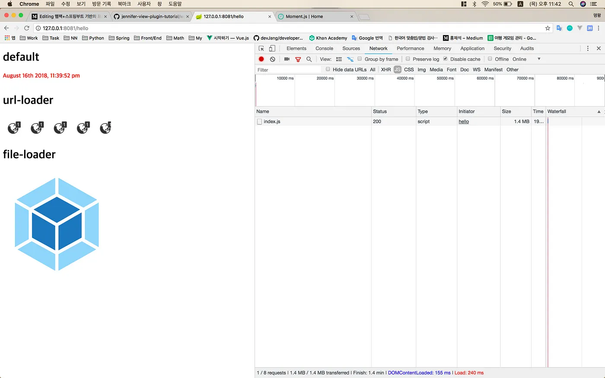

필자가 회사에서 개발 중인 제니퍼5의 수요가 크게 늘어남에 따라 고객의 기호에 맞게 화면에 대한 커스터마이징을 요구하는 경우가 많아졌다. 하지만 기존의 프로젝트에 커스터마이징 코드를 넣는 것은 바람직하지 않기 때문에 외부에서 구현하고, 플러그인처럼 추가하고 삭제할 수 있는 구조를 고민해야만 했다.

제니퍼5 뷰서버는 개발을 시작한지 7년이 넘은 꽤 오래된 코드로 구현되어 있다. 기반 프레임워크는 스프링3 버전이었는데, 플러그인 구조를 만들기 위해 큰 용기(?)를 내서 스프링4 버전으로 업그레이드 했다

어떻게 구현할까 오랫동안 고민했었는데, 그냥 단순하게 스프링 컨텍스트에 같이 올리는 방법을 택했다. 회사의 서버 개발자 분의 도움을 받아 간단한 클래스 로더를 만들었고, 외부에서 개발한 플러그인 jar 파일을 제니퍼5 뷰서버가 시작할 때, 같이 올라가는 구조였다.

이렇다보니 플러그인을 수정할 때마다 jar 파일을 생성하기 위해 빌드하고, 제니퍼5 뷰서버를 재시작 해야하는 번거로운 일을 반복하게 되었다. 그래서 독립적인 개발환경 구성을 위해 스프링부트(SpringBoot)와 웹팩(Webpack)을 고려하게 되었다.

서론이 많이 길어져서 독립적인 개발환경 구성에 대한 내용은 이 정도로 하고, 바로 본론으로 넘어가도록 하겠다. 본문에서는 인텔리제이(IntelliJ)에서 스프링부트 프로젝트를 생성하고, 스프링부트 재시작 없이 클래스와 리소스를 동적으로 반영해주는 핫스왑(Hot-Swap)에 대해 알아볼 것이다. 또한 웹팩 기반으로 스프링부트 프로젝트와 연계하여 프론트엔드 개발환경을 직접 구성해볼 것이다.

## (1) 스프링부트 핫스왑 설정하기

그럼, 먼저 스프링부트 프로젝트를 생성해보자.

 1. File > New > Project 클릭
 2. Spring Initialzr > Project SDK 선택 (1.8) > Next 클릭
 3. Project Metadata 입력 > Type 선택 (Maven Project) > Next 클릭
 4. Dependencies 입력 > Spring Boot 버전 선택 (1.5.15) > 라이브러리 선택
 5. 본문에서는 화면 개발과 핫스왑을 위한 최소한의 라이브러리만 선택하지만 개발 환경에 맞게 알아서 추가로 선택하면 된다.


템플릿 엔진은 기호에 맞게 다른걸 사용해도 상관없다. 이제 프로젝트가 생성되었으니 앞으로 두가지 설정만 하면 핫스왑 기능을 사용할 수 있게 된다.

> 다시 확인해보니 DevTools 라이브러리를 사용하지 않아도 된다. 핫스왑은 인텔리제이에서 제공해주는 아주 유용한 기능이다.

먼저 Preferences… 메뉴로 가서 Build, Execution, Deployment 탭의 Compiler 메뉴를 선택하고, **Build project automatically**를 체크해주면 된다.


마지막으로 Registry 설정 화면을 열어서 **compiler.automake.allow.when.app.running** 옵션을 체크해주자.


서버 개발환경은 이렇게 간단하게 구성하였지만 클라이언트 개발환경은 프로젝트 목적에 따라 차이가 있을 수 있다.

> 핫스왑 기능이 동작하기 위해서는 메인 클래스를 디버그 모드로 실행해야 하며, 코드를 수정하고나서 Build Project를 직접 실행해야만 반영이 빠르다.
참고로 순수 자바 클래스만 변경되었을 때만 동작하며, 스프링 관련 설정이나 컨텍스트에 변화가 있으면 메인 클래스를 재시작해야 한다.

## (2) 웹팩 설치하기

본문에서는 React나 Vue.js와 같은 프레임워크는 다루지 않으며, 클라이언트 개발을 위한 최소한의 환경만 구성할 것이다.
아주 당연한 얘기지만 Node.js와 NPM 패키지 관리자가 설치되어 있어야 하며, 모듈 번들링이 무엇인지에 대한 사전 이해가 필요하다.

그럼, 먼저 package.json 파일을 생성해보자. 인텔리제이 하단에 있는 터미널 탭을 선택하여 콘솔에 npm init을 입력한다.


명령어를 입력하고, 패키지 이름이나 버전 등을 입력할 수 있는데, 프로젝트 특성에 맞게 적당히 입력하거나 그냥 엔터키를 눌러서 기본값으로 설정할 수도 있다.

웹팩은 버전마다 설정 방식이 많이 다르므로 본문에서 다루는 내용은 최신 버전인 4.16.5를 기준으로 한다.

> npm install — save-dev webpack webpack-cli webpack-dev-server<br/><br/>
+webpack-cli@3.1.0<br/>
+webpack-dev-server@3.1.5<br/>
+webpack@4.16.5<br/>

webpack-cli는 웹팩 명령어 수행을 위한 패키지이고, webpack-dev-server는 스프링부트로 실행한 서버와 연계하기 위한 프록시 서버로 사용된다. 관련된 설명은 잠시 후에 나오니 일단은 넘어가도록 하자.

웹팩 설치가 완료되었으니 이제 모듈 번들링을 위한 로더들을 설치해야 한다. 로더의 종류는 매우 다양하지만 본문에서는 필자가 생각했을 때, 기본이 된다고 생각하는 것들만 다룰 것이다.

 * babel-loader : 자바스크립트 모듈 번들링을 위한 로더이며, 보통 ES6 코드를 ES5로 변환하기 위해 사용한다.
 * css-loader : 모듈 번들링은 자바스크립트 기반으로 이뤄지기 때문에 CSS 파일을 자바스크립트로 변환하기 위해 사용한다.
 * style-loader : css-loader에 의해 모듈화 되고, 모듈화 된 스타일 코드를 HTML 문서의 STYLE 태그 안에 넣어주기 위해 사용된다.
 * url-loader : 스타일에 설정된 이미지나 글꼴 파일을 문자열 형태의 데이터(Base64)로 변환하여 해당 CSS 파일 안에 포함시켜버리기 때문에 정적 파일을 관리하기 쉬워진다. 하지만 실제 파일들보다 용량이 커지고, CSS 파일이 무거워지므로 적당히 사용하는 것을 권장한다.
 * file-loader : 정적 파일을 로드하는데 사용되며, 보통 프로젝트 환경에 맞게 특정 디렉토리에 파일을 복사하는 역할을 수행한다.

참고로 바벨은 프리셋을 함께 설치해줘야 한다. 관련해서 설명할 내용이 많지만 본문의 주제에서 벗어나니 보편적으로 사용되는 것을 선택했다.

> npm install — save-dev babel-core babel-loader babel-preset-env css-loader style-loader url-loader file-loader

마지막으로 웹팩 실행을 위한 NPM 스크립트를 추가해보자. package.json의 최종 모습은 다음과 같을 것이다. 특이한건 env 변수인데, 웹팩 설정 파일 내에서 개발/배포 모드를 구분하기 위함이다.

```json
{
  "name": "frontend",
  "version": "1.0.0",
  "description": "",
  "main": "src/main/client/index.js",
  "scripts": {
    "prod": "webpack --env=production",
    "dev": "webpack-dev-server --env=development",
    "start": "npm run dev"
  },
  "author": "",
  "license": "ISC",
  "devDependencies": {
    "babel-core": "^6.26.3",
    "babel-loader": "^7.1.5",
    "babel-preset-env": "^1.7.0",
    "css-loader": "^1.0.0",
    "file-loader": "^1.1.11",
    "style-loader": "^0.22.1",
    "url-loader": "^1.0.1",
    "webpack": "^4.16.5",
    "webpack-cli": "^3.1.0",
    "webpack-dev-server": "^3.1.5"
  }
}
```

나중에 자세히 설명하겠지만, 일단 NPM 스크립트를 기억하고 있자.

> 개발할 때, npm run dev 또는 npm start<br/>
배포할 때, npm run prod

## (3) 스프링부트 컨트롤러 만들기

갑자기 스프링부트로 바뀌어서 당혹스럽겠지만 웹팩 설정을 하기에 앞서 간단하게 컨트롤러와 뷰를 만들어보자.

```java
package com.example.frontend;

import org.springframework.stereotype.Controller;
import org.springframework.ui.Model;
import org.springframework.web.bind.annotation.RequestMapping;

@Controller
public class FrontendController {
    @RequestMapping("/hello")
    public String home(Model model){
        model.addAttribute("message", "Hello, World!!!");
        return "index";
    }
}
```

다음은 홈 컨트롤러에서 받은 메시지 텍스트를 출력하는 템플릿 코드이다. 여기서 index.js를 로드하는데, 스프링부트는 src/main/resources/static 디렉토리를 정적 리소스 루트로 설정하기 때문에 index.js 파일은 여기에 두어야 한다.
물론 해당 디렉토리는 개발자 임의로 변경할 수도 있다.

```html
<!DOCTYPE html>
<html xmlns:th="http://www.thymeleaf.org">
<head>
    <meta charset="utf-8" />
    <script type="text/javascript" src="/index.js" th:src="@{/index.js}"></script>
</head>
<body>
<strong><div th:text="${message}"></div></strong>
</body>
</html>
```

스프링부트를 실행하고, http://127.0.0.1:8080/hello으로 이동하면 “Hello, World!!!” 메시지가 HTML 문서에 출력되고, 경고창에 “onload!!” 메시지가 보일 것이다.

```javascript
window.onload = function() {
    alert("onload!!");
}
```

## (4) 웹팩 기본 설정하기

웹팩은 진입점이라고 할 수 있는 엔트리 js 파일을 설정해야 한다. 엔트리 js 파일을 통해 각각의 모듈들을 로딩하고, 하나의 아웃풋 파일로 묶어(bundle)준다. 웹팩 개발 서버(webpack-dev-server)는 코드의 변경을 감지할 때마다 다시 번들링을 한다. 또한 아웃풋 파일이 적용된 화면을 실시간 리로딩(Live Reloading)하는 inline 옵션과 부분 모듈 리로딩(Hot Module Reloading)하는 hot 옵션을 제공한다.

앞에서 개발한 스프링부트 뷰에서 사용하기 위해서는 아웃풋 파일이 최종적으로 src/main/resources/static 디렉토리에 위치해야 한다. 하지만 클라이언트 코드를 수정할 때마다 static 디렉토리에 아웃풋 파일이 반영되면 스프링부트 핫스왑 기능이 활성화 되어 불필요한 스프링 컨텍스트 리로드가 발생할 수 있다.

그래서 필자는 클라이언트 아웃풋 파일을 별도의 디렉토리에 생성하게 하고, 해당 디렉토리를 웹팩 개발 서버의 루트(contentBase)로 설정할 것이다. 그렇다면 이미 실행 중인 스프링부트와 연계는 어떻게 할 수 있을까? 일단 웹팩 설정 파일부터 살펴보자.

```javascript
const path = require('path')

module.exports = (env) => {
    let clientPath = path.resolve(__dirname, 'src/main/client');
    let outputPath = path.resolve(__dirname, 'out');

    return {
        mode: !env ? 'development' : env,
        entry: {
            index: clientPath + '/index.js'
        },
        output: {
            path: outputPath,
            filename: '[name].js'
        }
    }
}
```

일단 env 변수는 NPM 명령어 실행시 넘겨주는 값이다. 웹팩4부터는 mode에 development 또는 production을 명시해야 한다. 일단 배포 환경 구성은 현재 다루지 않으니 이 부분은 넘어가도록 하겠다.

앞에서 생성한 스프링부트 프로젝트에서 클라이언트 개발 코드는 src/main/client 디렉토리에서 관리하기로 하고, 해당 디렉토리에 있는 index.js 파일을 엔트리 js 파일로 설정했다. 그리고 아웃풋 파일의 생성 디렉토리는 src/main/resources/static이 아닌 out으로 설정했다. 참고로 output.filename 옵션 값이 [name].js인데, 여기서 [name]은 entry 옵션의 key 이름으로 치환된다. 이 밖에도 [id], [hash] 같은 치환 문자열이 있다.

다음은 웹팩 개발 서버 설정이다. 먼저 devServer.contentBase 옵션 값은 아웃풋 파일들이 생성되는 디렉토리와 맞춰야 하기 때문에 output.path와 동일하게 설정해야 한다. devServer.port는 스프링부트 포트와 다른 값을 설정하면 된다. 마지막으로 웹팩 개발 서버와 스프링부트를 연계하기 위해 devServer.proxy 옵션을 사용한다. key는 요청 URL이고, value는 프록시 대상이다.

http://127.0.0.1:8081/hello로 접근하면 스프링부트 컨트롤러에서 넘긴 값으로 구현된 뷰에서 웹팩 개발 서버의 contentBase 옵션에 설정된 디렉토리 안에 있는 정적 파일들을 로드할 수 있게 된다.

```javascript
...,
        devServer: {
            contentBase: outputPath,
            publicPath: '/',
            host: '0.0.0.0',
            port: 8081,
            proxy: {
                '**': 'http://127.0.0.1:8080'
            },
            inline: true,
            hot: false
        }
    }
}
```

간단하게 프록시 설정이 잘되어 있는지 확인하기 위해 src/main/client 디렉토리에 index.js 파일을 추가하자. 아까 만든 index.js와 차이를 두기 위해 메시지를 “proxy onload!!”로 변경했다.

```javascript
window.onload = function() {
    alert("proxy onload!!");
}
```

그럼, 스프링부트와 웹팩 개발 서버를 실행해보자.

```shell
npm start
webpack-dev-server — env=development

ℹ ｢wds｣: Project is running at http://0.0.0.0:8081/
ℹ ｢wds｣: webpack output is served from /
ℹ ｢wds｣: Content not from webpack is served from /Users/alvin/Documents/Workspace/springboot/frontend/out
ℹ ｢wdm｣: Hash: 5d0bf01db3a4b9a400bf
Version: webpack 4.16.5
Time: 395ms
Built at: 08/16/2018 7:25:02 PM
Asset Size Chunks Chunk Names
index.js 338 KiB index [emitted] index
Entrypoint index = index.js
```

http://127.0.0.1:8080/hello로 접속하면 경고창에 “onload!!” 메시지가 보일 것이고, http://127.0.0.1:8081/hello로 접속해서 “proxy onload!!” 메시지가 보인다면 웹팩 기본 설정이 잘 완료된 것이다.

## (5) 웹팩 로더 설정하기

앞에서 엔트리와 아웃풋을 설정했다. 현재 설정으로는 오직 js 파일만 번들링 할 수 있다. 하지만 클라이언트 개발은 css 파일이나 이미지 파일들도 필요하기 때문에 관련된 웹팩 로더를 추가해줘야 한다.

참고로 css 파일은 로드하더라도 js 파일로 번들링 되기 때문에 관련 플러그인을 추가로 설치하여 css 파일만 따로 분리할 것이다.

> npm install — save-dev mini-css-extract-plugin

앞에서 style-loader에 대한 설명을 했는데, 본문에서는 다루지 않을 것이다. 개발 뿐만이 아니라 배포까지 생각하면 STYLE 태그에 스타일 코드가 들어가는 것보단 하나의 css 파일로 번들링되는 것이 바람직하다고 생각한다.

```javascript
const path = require('path')
const MiniCssExtractPlugin = require('mini-css-extract-plugin')

module.exports = (env) => {	module.exports = (env) => {
    let clientPath = path.resolve(__dirname, 'src/main/client');
    let outputPath = path.resolve(__dirname, 'out');

    return {
        ...,
        module: {
            rules: [{
                test: /\.js$/,
                use: [{
                    loader: 'babel-loader',
                    options: {
                        presets: 'env'
                    }
                }]
            }, {
                test: /\.(css)$/,
                use: [{
                    loader: MiniCssExtractPlugin.loader
                }, {
                    loader: 'css-loader'
                }]
            }]
        },
        plugins: [
            new MiniCssExtractPlugin({
                path: outputPath,
                filename: '[name].css'
            })
        ]
    }
}
```

웹팩 설정 파일에 추가된 module 옵션을 살펴보면 babel-loader를 통해 ES6 코드를 ES5로 변환할 수 있다. style-loader는 방금 설치한 MiniCssExtractPlugin.loader로 변경되었고, 엔트리 js 파일에서 css 파일을 로드하기 위해 css-loader도 함께 사용되었다.

여기서 중요한 점은 plugins 옵션에 MiniCssExtractPlugin 객체가 추가되었다는 사실이다. 번들링 된 css 파일은 기존의 아웃풋 파일과 같은 디렉토리에 위치해야하므로 path 옵션 값은 output.path와 동일하다. 그리고 css 파일 이름은 entry 옵션에 설정된 key 이름으로 치환된다.

이제 js 파일 뿐만이 아니라 css 파일까지 번들링 할 수 있게 되었는데, 뭔가 부족하다. 스타일에서 이미지를 사용하고 싶을 때는 어떻게 해야할까?

### 이미지 파일 사용하기

답은 바로 url-loader와 file-loader를 사용하는 것이다. 필자는 정적 파일 관리가 귀찮아서 url-loader를 선호하는 편인데, 아무래도 번들링 된 css 파일이 엄청 커질 수 있기 때문에 크기가 작은 이미지만 사용하는게 좋다.

본문에서는 두가지 로더를 모두 테스트해보기 위해 svg 파일은 file-loader를 사용하고, 나머지 이미지 파일은 url-loader를 사용하였다. 단순히 테스트 용도이므로 취향에 맞게 알아서 고쳐서 사용하면 된다.

```javascript
...
        module: {
            rules: [..., {
                test: /\.(jpe?g|png|gif)$/i,
                use: [{
                    loader: 'url-loader',
                    options: {
                        limit: 1024 * 10 // 10kb
                    }
                }]
            }, {
                test: /\.(svg)$/i,
                use: [{
                    loader: 'file-loader',
                    options: {
                        name: '[name].[ext]',
                        outputPath: 'images/'
                    }
                }]
            }]
        },
        ...
```

두개의 로더를 추가했다. 먼저 url-loader는 10KB 미만의 jpg, png, gif 파일을 문자열 형태의 데이터(Base64)로 변환한다. 그리고 svg 파일만 file-loader에서 가져오게 되는데, outputPath 옵션을 통해 가져온 svg 파일의 디렉토리를 설정한다. svg 파일 이름이 webpack.svg라면 http://127.0.0.1:8081/images/webpack.svg 경로로 화면에 로드된다.

### 프로젝트 코드 수정하기

이제 웹팩 로더 설정도 끝났겠다. 앞에서 말한 내용들을 테스트해보기 위해 index.css와 index.html 파일을 수정해보자.

```css
strong {
    color : red;
}

.pattern {
    width: 300px;
    height: 64px;
    display: inline-block;
    background-image: url("./images/globe.png");
    background-repeat: repeat-x;
}

.image {
    width: 300px;
    height: 300px;
    display: inline-block;
    background-image: url("./images/webpack.svg");
}
```

```html
<!DOCTYPE html>
<html xmlns:th="http://www.thymeleaf.org">
<head>
    <meta charset="utf-8" />
    <script type="text/javascript" src="/index.js" th:src="@{/index.js}"></script>
    <link rel="stylesheet" type="text/css" media="all" href="/index.css" th:href="@{/index.css}" />
</head>
<body>
    <h1>default</h1>
    <strong><div th:text="${message}"></div></strong>
    <br/>

    <h1>url-loader</h1>
    <div class="pattern"></div>
    <br/>

    <h1>file-loader</h1>
    <div class="image"></div>
</body>
</html>
```

## (6) 청크(chunk) 관리하기

클라이언트 개발을 하다보면 다양한 라이브러리들을 사용하게 된다. 현재 웹팩 설정으로 번들링하게 되면 아웃풋 파일의 크기가 엄청 커질 것이고, 초기 로딩 속도에도 악영향을 미칠 것이다. 그럼, 지금부터 아웃풋 파일을 현재 개발 중인 코드와 라이브러리로 분리해보자.

> npm install — save jquery moment

테스트를 위해 jquery와 moment 라이브러리를 설치했다. 그리고 jquery와 moment를 사용하여 onload 시점에 현재 시간을 출력해주는 코드를 추가했다.

```javascript
import Styles from './index.css'
import $ from 'jquery'
import moment from 'moment'

$(function() {
    $("strong > div").html(moment().format('MMMM Do YYYY, h:mm:ss a'));
});
```

코드를 분리하지 않으면 다음과 같이 아웃풋 파일의 용량이 매우 커진다.



그럼, 다시 웹팩 설정 파일을 수정해보자.

```javascript
...
        entry: {
            vendors: [ 'jquery', 'moment' ],
            index: clientPath + '/index.js'
        },
        output: {
            path: outputPath,
            filename: '[name].js'
        },
        optimization: {
            splitChunks: {
                chunks: 'all',
                cacheGroups: {
                    vendors: {
                        test: /[\\/]node_modules[\\/]/,
                        name: 'vendors'
                    }
                }
            }
        },
        ...
```

entry 옵션에 vendors가 추가된 것을 확인할 수 있다. index와 달리 문자열 배열 값이 들어있는데, 실제로 사용한 라이브러리 이름을 명시하면 된다. 다음은 optimization.splitChunks 옵션이다. 여기서 중요한건 청크 대상을 node_modules 디렉토리 내로 제한한 것이다.

청크 방법은 너무 다양해서 별도의 주제로 다루는 것이 좋을 것 같으니 본문에서는 이 정도로 설명을 마치겠다. 그리고 아웃풋 파일이 하나 더 생겼으니 index.html 파일도 변경하도록 하자.

```html
<head>
    <meta charset="utf-8" />
    <script type="text/javascript" src="/vendors.js" th:src="@{/vendors.js}"></script>
    <script type="text/javascript" src="/index.js" th:src="@{/index.js}"></script>
    <link rel="stylesheet" type="text/css" media="all" href="/index.css" th:href="@{/index.css}" />
</head>
```

## (7) 배포 환경 설정하기

그동안 번들링 된 아웃풋 파일들을 웹팩 개발 서버의 contentBase 디렉토리에 두고 프록시를 통해 스프링부트 뷰에서 로드했었다. 배포 시점이 되면 아웃풋 파일들을 스프링부트의 정적 리소스 루트 디렉토리로 옮겨야 한다.

배포를 위한 빌드 설정은 매우 간단하다. 웹팩 설정 파일에서 처음 정의한 outputPath 변수 값을 스프링부트의 정적 리소스 루트 디렉토리로 설정하면 된다.

```javascript
// Before
let outputPath = path.resolve(__dirname, 'out')

// After
let outputPath = path.resolve(__dirname, (env == 'production') ? 'src/main/resources/static' : 'out')
```

수정이 완료되었으면 다음과 같이 NPM 스크립트를 실행한다.

```shell
npm run prod

> frontend@1.0.0 prod /Users/alvin/Documents/Workspace/springboot/frontend
> webpack — env=production

Hash: 8d360cf3a938a8cf0cf7
Version: webpack 4.16.5
Time: 7262ms
Built at: 08/17/2018 1:39:52 AM
```

이제는 스프링부트만 실행해도 클라이언트 코드가 잘 동작하는 것을 확인할 수 있을 것이다. 하지만 아직 뭔가 부족하다. 아무래도 배포되는 파일인데, 최적화를 해야할 것 같다.

웹팩4에서 기본으로 배포되고 있는 uglify-webpack-plugin과 optimize-css-assets-webpack-plugin을 추가로 설치하여 배포 시점의 아웃풋 파일들을 최적화 해보자.

> npm install — save-dev optimize-css-assets-webpack-plugin

드디어 마지막 단계이다. 배포 모드일 때, optimization.minimizer 옵션에 두 플러그인의 객체를 추가해주면 모든 웹팩 설정이 끝이난다.

```javascript
const path = require('path')
const MiniCssExtractPlugin = require('mini-css-extract-plugin')
const UglifyJsPlugin = require('uglifyjs-webpack-plugin')
const OptimizeCssAssetsPlugin = require('optimize-css-assets-webpack-plugin')

module.exports = (env) => {
    let clientPath = path.resolve(__dirname, 'src/main/client');
    let outputPath = path.resolve(__dirname, (env == 'production') ? 'src/main/resources/static' : 'out')

    return {
        mode: !env ? 'development' : env,
        entry: {
            vendors: [ 'jquery', 'moment' ],
            index: clientPath + '/index.js'
        },
        output: {
            path: outputPath,
            filename: '[name].js'
        },
        optimization: {
            splitChunks: {
                chunks: 'all',
                cacheGroups: {
                    vendors: {
                        test: /[\\/]node_modules[\\/]/,
                        name: 'vendors'
                    }
                }
            },
            minimizer: (env == 'production') ? [
                new UglifyJsPlugin(),
                new OptimizeCssAssetsPlugin()
            ] : []
        },
        devServer: {
            contentBase: outputPath,
            publicPath: '/',
            host: '0.0.0.0',
            port: 8081,
            proxy: {
                '**': 'http://127.0.0.1:8080'
            },
            inline: true,
            hot: false
        },
        module: {
            rules: [{
                test: /\.js$/,
                use: [{
                    loader: 'babel-loader',
                    options: {
                        presets: 'env'
                    }
                }]
            }, {
                test: /\.(css)$/,
                use: [{
                    loader: MiniCssExtractPlugin.loader
                }, {
                    loader: 'css-loader'
                }]
            }, {
                test: /\.(jpe?g|png|gif)$/i,
                use: [{
                    loader: 'url-loader',
                    options: {
                        limit: 1024 * 10 // 10kb
                    }
                }]
            }, {
                test: /\.(svg)$/i,
                use: [{
                    loader: 'file-loader',
                    options: {
                        name: '[name].[ext]',
                        outputPath: 'images/'
                    }
                }]
            }]
        },
        plugins: [
            new MiniCssExtractPlugin({
                path: outputPath,
                filename: '[name].css'
            })
        ]
    }
}
```

## (8) 보너스

이렇게 강좌가 끝나면 아쉬워할것 같아서 개발할 때, 도움이 될 만한 플러그인을 추가로 소개할까한다. js 파일들이 하나의 아웃풋 파일로 번들링 될 때, 내부 구조가 궁금할 수 있다. 또한 청크 설정이 잘못되어 생각했던 것과 다르게 파일이 분리되는 경우도 있다.

> npm install — save-dev webpack-bundle-analyzer

플러그인을 설치하고, 다음과 같이 웹팩 설정 파일을 수정하자.

```javascript
...
const BundleAnalyzerPlugin = require('webpack-bundle-analyzer').BundleAnalyzerPlugin

module.exports = (env) => {
    ...

    return {
        plugins: [
            ...
            , new BundleAnalyzerPlugin()
        ]
    }
}
```

웹팩 개발 서버가 실행되면 8888 포트로 웹 페이지가 하나 열리는데, 트리맵 형태로 js 파일들이 보여지며, 파일 용량이 클수록 트리 노드가 넓어진다.


## (9) 프로젝트 다운로드

본문에서 다룬 내용은 모두 GitHub 저장소에 올려놨으니 바로 테스트 해볼 수 있다. 다음 강좌를 위해서 계속 업데이트할 프로젝트이니 Watch나 Star를 누르면 최신 상태를 업데이트 받을 수 있을 것이다. ㅎㅎ

> https://github.com/seogi1004/webpack-springboot-starter