## 글을 시작하며…

작년에 머신러닝에 대한 검색을 하다가 우연히 “수학을 포기한 직업 프로그래머가 기계학습을 시작하기 위한 최단경로”라는 번역 글을 보고, 처음으로 선형대수에 대해 관심을 가지고 공부를 시작했다.
해당 글에서 프로그래머를 위한 수학책으로 “코딩 더 매트릭스”를 추천했는데, 실은 그 책 때문에 연재 글을 기획하게 되었다.
필자는 수포자의 길을 30년 넘게 걸어온 사람으로서 “코딩 더 매트릭스”는 굉장히 이해하기가 어려운 책이었다.
그래서 필자는 큰 흐름은 선형대수를 시각적으로 이해하는 형태로 글을 연재할 예정이며, 세부 내용은 “코딩 더 매트릭스”에서 많이 차용할 생각이다.

## 코딩 더 매트릭스

필자는 일주일에 한번 “코딩 더 매트릭스” 스터디 모임을 갖는다.
벌써 스터디가 시작된지 1년이 넘었지만 이제 겨우 70% 정도 진행한 것 같다.
원래 공부를 잘하는 사람이 아니지만 살면서 이렇게 난해한 책은 처음봤다.
물론 번역서라서 원서의 의도가 제대로 전달되지 않은 것일 수도 있지만 저자가 무엇을 말하고 싶은지 어떤 의미를 말하는지 필자의 수준으로는 해석하기 어려운 부분이 너무 많았다.
또한 “코딩 더 매트릭스” 본문에서 제공되는 각종 예제들이 제대로 동작하지 않을뿐더러 관련된 자료를 찾기가 매우 어려웠다.
그래서 자료를 찾기 위해 열심히 검색해봤는데, 우리나라 뿐만이 아니라 외국에서도 “코딩 더 매트릭스”를 완독한 사람이 많지 않은 것으로 파악되어 1년이 넘도록 완독하지 못한 자괴감에서 조금이나마 벗어날 수 있었다.

## 진행 방식

본문에서는 주제와 관련된 수학 공식이나 개념에 대해 자세히 다루지 않을 것이다.
그래서 글을 읽기 전에 최소한 주제에 해당하는 수학적 지식은 갖추고 있어야 한다.
필자는 수포자가 되기 전에는 왜 수학을 공부해야 하는지 몰랐었고, 개발자로 일하면서 중요성은 알았지만 수학의 필요성에 대해 제대로 이해하지 못했었다.
그래서 필자는 본문에서 다룰 주제에 대해 어떻게 응용될 수 있는지 필요성에 대한 근본적인 질문을 해볼 것이며, 최대한 시각적으로 표현하거나 실제로 응용해볼 수 있는 방법으로 답을 찾아볼 것이다.
그리고 본문에서 소개되는 예제에서 기하학적 요소는 자바스크립트(jui)로 구현할 것이며, 행렬이나 복소수 연산을 위해 파이썬(numpy)을 사용할 것이다.

## 선형연립방정식

2개 이상의 미지수를 포함하는 2개 이상의 방정식의 쌍이 주어지고, 미지수가 주어진 모든 방정식을 동시에 만족할 것이 요구되어 있을때, 이 방정식의 쌍을 연립방정식이라고 한다.
아래 인용구는 이상구 교수님의 선형대수 강의에서 발췌한 내용이다. (<a href="https://www.youtube.com/watch?v=AAUQvdjQ-qk&feature=youtu.be" target="_blank">링크</a>)

> 역사적으로 선형대수학의 가장 중요한 주제 중 하나가 선형연립방정식과 해법이다. 21세기 우리는 수천 개의 미지수를 갖는 연립방정식을 자연과학, 공학, 경제학, 교통의 흐름, 일기예보, 의사결정 등 수많은 분야에서 만난다. 컴퓨터의 계산능력(computing power)이 향상됨에 따라 응용학문에서 선형대수학의 중요성은 날로 커져 왔다. 컴퓨터는 병렬처리와 대규모 계산을 매개로 선형대수학과 긴밀하게 연결된다. 이로 인해 현재의 과학자, 공학자들은 이전에는 상상만 하던 매우 복잡한 문제를 다를 수 있게 되었다. 또 선형대수학의 지식은 어떤 과목보다 더 넓은 과학, 경영분야의 활용도를 지닌다.

예를 들어 직선의 방정식으로 그린 두 개의 직선이 있을 때, 두 직선의 교점을 선형연립방정식의 유일한 해(solution)라고 한다.
만약에 두 직선이 평행하다면 교점이 존재하지 않으므로 해를 갖지 않는게 되며, 두 직선이 겹친다면 무수히 많은 해를 가지게 된다.
즉, 선형연립방정식의 해집합은 앞에서 말한 세가지 가능성 중에 하나만 성립한다. 그럼, 먼저 간단하게 두 직선의 방정식의 해를 구해보도록 하자.

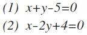

아래 예제에서 빨간색 직선은 방정식 (1)이며, 파란색 직선은 방정식 (2)를 그린 것이다.
두 직선이 교차하는 부분에 마우스를 올리면 나타나는 좌표가 바로 교점(3,2)이다.
해당 좌표 값을 방정식 (1), (2)에 각각 대입해보면 방정식이 성립한다는 것을 확인할 수 있다.

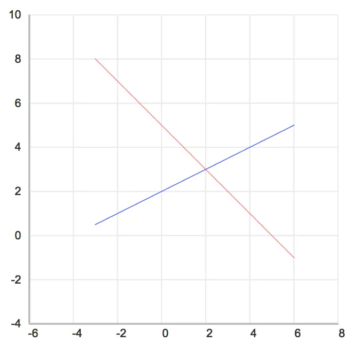

## 선형연립방정식 응용

앞에서 직선의 방정식이 다수가 존재하고 유일한 해가 존재할 때, 교점을 구하는 방법에 대해 알아보았다.
지금부터는 반대로 지나는 점들을 가지고 원의 방정식과 방데르몽드 다항식을 구하여 차트로 그려볼 것이다.
원의 방정식의 일반형은 아래와 같다.

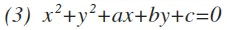

지나는 점의 좌표값 (-2,2), (4,-6), (5, -5)를 알고 있다면 원의 방정식의 일반형에 각각 x와 y값을 대입한다.

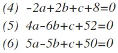

다소 복잡해졌지만 연립방정식을 풀면 각각 a=-2, b=4, c=-20가 구해지는데, 이 값들을 다시 원의 방정식에 대입한다.

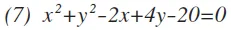

완성된 원의 방정식에 x값을 차트에서 지정된 모든 좌표를 대입하여 y값을 구하는 방식으로 그렸는데, 성능에 문제가 많고 최적의 방법은 아니라서 권장하지는 않는다.
관련해서는 각자 기호에 맞게 구현해보는 것으로 하자.

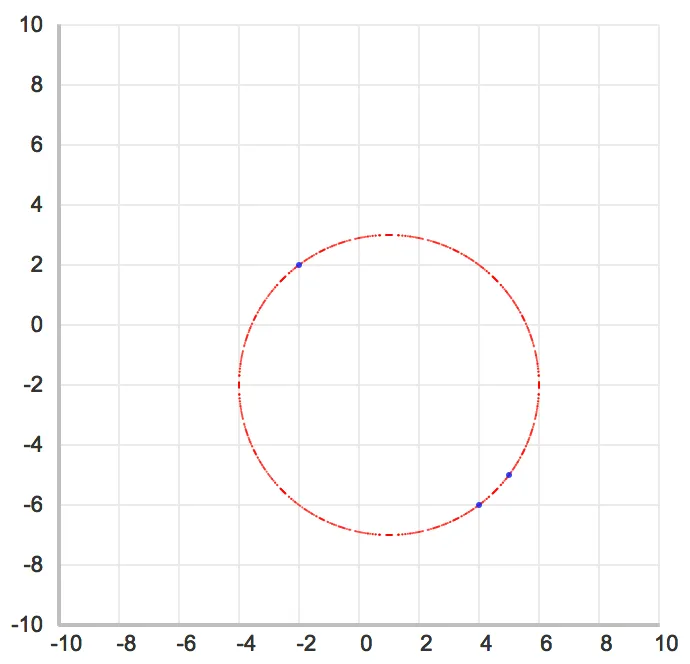

이제 어느 정도는 선형연립방정식을 어떻게 활용해야 하는지에 대한 감이 올 것 같은데, 추가로 다수의 점을 지나는 곡선을 그릴 수 있는 라그랑주(lagrange) 다항식을 구하여 차트로 그려보면 좀 더 확신이 생길것 같다.

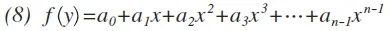

일단 네 점의 좌표값 (1,3), (2,-2), (3,-5), (4,0)를 라그랑주 다항식에 각각 x와 y 값을 대입한다.

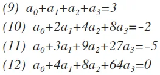

원의 방정식과 동일하게 연립방정식을 풀면 각각 a0=3, a1=3, a2=-5, a3=1이 구해는데, 이 값들을 다시 라그랑주 다항식에 대입한다.

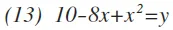

완성된 라그랑주 다항식에 원의 방정식과 동일한 방법으로 x값에 지정된 모든 좌표를 대입하여 y값을 구하는 방식으로 그리면 된다.

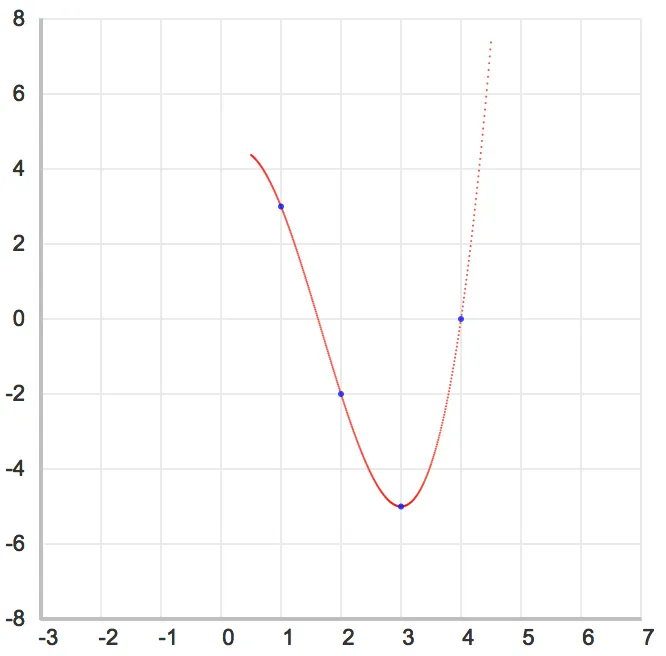

## 결론

웹에서 그래픽을 표현하기 위해 SVG나 캔버스에서 제공되는 API를 사용하면 매우 쉽게 선이나 도형 같은 그래픽 요소들을 그릴 수 있다.
예를 들어 선을 그리기 위해서 두 점의 좌표만 입력하면 쉽게 그릴 수 있는데, 내부적으로는 두 점의 관계에 대한 직선의 방정식을 구하고, 최대한 자연스러운 형태로 그려질 수 있도록 별도의 알고리즘이 적용되어 있을 것이다. 이는 직선 뿐만이 아니라 원이나 타원 등의 다양한 방정식에 적용될 수 있다. 필자는 방정식의 원형을 일종의 템플릿으로 규정하고, 지나는 점들의 좌표를 템플릿에 적용되는 입력 값이라고 생각한다.
값이 입력이 되고 생성된 템플릿의 집합을 연립방정식으로 다시 규정하고, 구해진 유일한 해(solution)를 방정식의 계수에 대입하여 최종의 방정식을 구한다.
조금 복잡한 과정이라고 생각할 수 있지만 입력하는 부분과 해를 구하는 부분은 공통적인 사항이고, 그려지는 모양에 따라 방정식만 다르게 적용하면 되기 때문에 일종의 템플릿이라고 규정한 것이다.

## 글을 마치며…

선형대수를 공부하는 것 자체만으로도 필자에게는 매우 큰 도전이었다.
그리고 이에 대한 글을 쓴다는 것은 상상조차 할 수 없는 일이었다.
그래서 누군가에게 내가 알고 있는 것을 공유하겠다는 차원이 아닌 필자의 생각을 정리하고, 이게 정말 옳은 생각인지 스스로에게 묻기 위한 행동이라고 말하고 싶다.
마지막으로 이상구 교수님의 선형대수 강의에서 소개된 응용 사례를 소개하고 글을 마치겠다.

> 한 천문학자가 어떤 소행성 궤도를 구하려고 한다. 이를 위해 그는 태양을 원점으로 갖는 좌표평면을 설정하였다. 축의 눈금 단위들은 천문학의 측정단위(천문학 단위 1은 지구에서 태양까지의 평균거리이며 약 149,637,000km)가 사용된다. 행성은 타원형 궤도를 따라 운행한다. (케플러의 제1법칙)

천문학자는 다섯 번에 걸쳐 행성의 위치를 나타내는 (8.025,8.310), (10.170,6.355), (11.202,3.212), (10.736,0.375), (9.092,2.267) 관측점을 구하고, 이를 본문에서 다룬 방법으로 타원의 방정식을 구해서 그리면 행성의 궤도를 알 수 있게 된다.

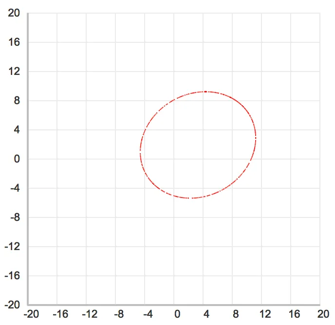