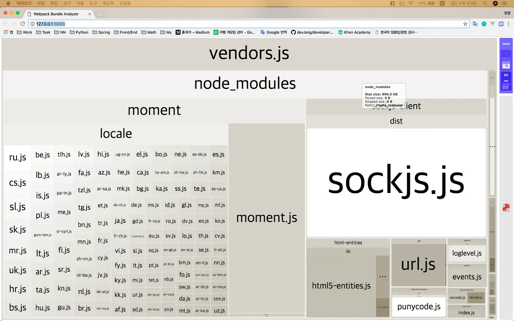
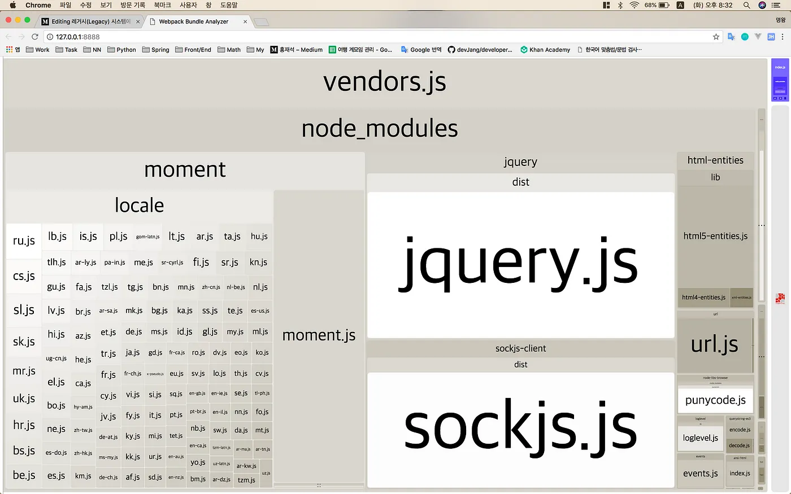

[“Webpack+SpringBoot 기반의 프론트엔드 개발 환경 구축하기”](/blog/2017-08-17-webpack-springboot-starter/index.mdx) 편에서 스프링부트 프로젝트를 생성하고, 서버와 클라이언트 코드를 통합 빌드/배포할 수 있는 개발 환경을 구축해봤다. 모던한 개발 환경에서 코드를 구현한다는 것은 프로그래머에게 축복이나 다름없다. 바벨(Babel)의 등장으로 브라우저가 지원하지 않더라도 최신 자바스크립트 스펙을 적용한다는 것이 얼마나 행복한 일인지는 클라이언트 개발을 해본 사람이라면 누구나 공감할 것이다.

하지만 현실은 우리의 앞을 가로막고 있는 레거시(Legacy)라는 커다란 벽이다. 개인 프로젝트가 아니라면 기존의 시스템을 새롭게 바꾼다는 것이 얼마나 어려운 일인지 다 알고 있으리라 생각된다. 그렇다면 왜 어려울까? 필자가 생각하는 가장 큰 이유는 공감을 얻기가 어렵기 때문이다. 이미 안정적으로 잘 돌아가고 있는 시스템을 괜히 건들여서 장애가 생긴다면 앞으로의 개발 일정에 차질이 생길 수 있는데, 과연 누가 이해해줄 수 있을까?

앞에서 말한 문제만으로도 글 한편은 쓸 수 있을 것 같은데, 할 말은 많지만 일단 이 정도로 하겠다. 지난 글에 이어 이번에도 서론이 길었다. 그리고 지난 글과 달리 이번에는 확실한 솔루션이 아니라는 점을 참고하길 바란다. 무구한 역사와 전통이 담긴 레거시(?)는 쉽게 바꿀 수 있는 것이 아니다. 단지 필자는 조금이나마 도움이 될 수 있는 기법 몇가지를 본문에서 다룰 것이다.

## (1) 번들링 파일에서 모듈 제외하기

기존의 웹 페이지에 내가 만든 새로운 기능이 번들링되서 배포되었다고 가정해보자. 해당 웹 페이지는 공통 기능 구현을 위한 라이브러리(jquery, moment)가 이미 로드되어 사용 중이었다. 하지만 내가 만든 새로운 기능에도 개발의 편의를 위해 jquery를 사용했다. 이런 상황이면 글로벌 모듈인 jquery가 로드되고, 새로운 기능의 번들링 파일에도 포함되어 있기 때문에 웹페이지는 jquery를 두번 로드하는게 된다.

웹팩의 externals 옵션을 통해 개발 코드가 번들링 될 때, 특정 모듈을 제외시킬 수 있는데, 위와 같은 상황에서는 jquery를 제외하면 문제가 해결된다. 단지 번들링 되는 파일에서 제외하는 것이기 때문에 기존의 모듈 기반의 자바스크립트 코딩을 그대로 할 수 있게 된다.

그럼, 먼저 이전 강좌에서 개발했던 프로젝트의 **src/main/resources/templates/index.html**에 CDN으로 배포된 jQuery 라이브러리를 로드하는 코드를 넣어보자.

```html
<script type="text/javascript" src="https://cdnjs.cloudflare.com/ajax/libs/jquery/3.3.1/jquery.js"></script>
```

그리고 템플릿에서 jQuery 라이브러리를 로드하기 때문에 번들링 할 필요가 없기 때문에 웹팩 설정 파일에서 entry.vendors 옵션의 jquery 값을 제거하자. 마지막으로 번들링에서 제외하기 위해 externals 옵션에 key는 모듈명, value는 글로벌 변수 이름 형태로 추가할 수 있다. 글로벌 변수 이름은 문자열 뿐만이 아니라 정규식, 콜백 함수, 객체 형태로도 설정할 수 있으니 자세한 사항은 공식 문서를참고하자.

```javascript
...
        entry: {
            vendors: [ 'moment' ],
            index: clientPath + '/index.js'
        },
        externals: {
            jquery: "jQuery"
        },
        ...
```

다음은 externals 옵션을 적용하고, 번들링 했을 때의 내부 구조이다. 이전 강좌에 봤던 트리맵에 jquery.js 노드가 빠진 것을 확인할 수 있다.



### 프로젝트 다운로드

이전 강좌에서 제공한 프로젝트에서 **extenals** 브랜치로 변경하여 체크아웃 받으면 된다.

## (2) 레거시 코드를 모듈로 로드하기

레거시 시스템이 커지다보면 어쩔 수 없이 사용해야만 하는 자바스크립트 코드들이 존재한다. 필자의 경우, 다국어 처리를 위한 메시지를 가져오는 공통 함수를 클라이언트 개발시 사용한다.

해당 자바스크립트 파일은 서버에서 특정 주기로 동기화하는 조금은 복잡한 과정을 거쳐 생성된다. 결국 레거시 코드를 모듈로 로드하여 사용해야만 하는데, externals-loader를 사용하면 이러한 문제를 해결할 수 있다.

> npm install — save-dev exports-loader

다음 코드를 살펴보자. 오랜만에 ES5 코드를 보니 반갑기도 하다.

```javascript
var file = 'blah.txt';

var helpers = {
    test: function() {
        console.log('test something');
    },
    parse: function() {
        console.log('parse something');
    }
};

var math = {
    add: function(a, b) {
        return a + b;
    },
    subtract: function(a, b) {
        return a - b;
    }
};
```

다음 설정을 통해 lib/utils.js 파일을 모듈로 임포트해서 사용해보자.

```javascript
...
            , {
                test: path.resolve(__dirname, 'lib', 'utils.js'),
                use: 'exports-loader?file,math,parse=helpers.parse'
            }]
        },
        ...
    }
}
```

콤마(,)로 구분해서 글로벌 변수 이름을 넣어주면 되고, 만약에 객체라면 특정 프로퍼티나 메소드만 설정할 수 있다. 다음은 exports-loader 설정을 통해 생성된 모듈을 임포트하여 사용하는 코드이다.

```javascript
import Styles from './index.css'
import $ from 'jquery'
import mt from 'moment'
import {file, math, parse} from '../../../lib/utils.js'

$(function() {
    $("strong > div").html(mt().format('MMMM Do YYYY, h:mm:ss a'));

    console.log(file)
    parse();

    alert(math.add(6, 4));
});
```

### 프로젝트 다운로드

이전 강좌에서 제공한 프로젝트에서 **externals-loader** 브랜치로 변경하여 체크아웃 받으면 된다.

## (3) 글로벌 변수로 모듈 사용하기

웹팩은 모듈을 임포트(import) 하지 않아도, 글로벌 종속성을 가지는 객체(또는 변수)를 제공할 수 있는 기능을 제공한다. 웹팩에서 기본적으로 배포하는 ProvidePlugin을 사용하면 하는데, 동작 원리는 매우 심플하다. 코드 상단에 플러그인에 추가된 key 이름을 가지는 변수에 value 이름을 가지는 모듈을 require 해주기 때문에 jQuery를 임포트 하지 않아도 사용할 수 있다.

```javascript
const $ = require('jquery');
// 첫번째 라인은 ProvidePlugin에서 추가함
// 실제로는 존재하지 않음

$(function() {
  alert('onload');
}
```

다음 코드는 순수 레거시 코드를 복사하여 붙여넣기 한 것이다. 참고로 mt는 moment 라이브러리인데, 레거시 코드에서 글로벌 변수 이름 중첩으로 인해 mt로 변경해서 사용하고 있다고 가정해보자. 그리고 math는 필자가 미리 구현해둔 커스텀 모듈이다.

```javascript
$(function() {
    $("strong > div").html(mt().format('MMMM Do YYYY, h:mm:ss a'));

    alert(math.add(6, 4));
});
```

```javascript
export function add(a, b) {
    return a + b;
}

export function subtract(a, b) {
    return a - b;
}
```

ProvidePlugin은 파일시스템 기반으로 동작하기 때문에 사용자가 만든 모듈의 경로만 넣어주면 얼마든지 글로벌 변수를 추가할 수 있다. 그리고 imports-loader를 사용하면 좀 더 세밀한 기능을 사용할 수 있다.

```javascript
plugins: [
            ...,
            new webpack.ProvidePlugin({
                $: 'jquery',
                mt: 'moment',
                math: path.resolve(__dirname, 'lib', 'math.js')
            })
        ]
    }
}
```

> npm install — save-dev imports-loader

다음은 config.size 값을 imports-loader를 통해 설정하여, 기존의 레거시 코드에서 사용하는 코드이다.

```javascript
$(function() {
    $("strong > div").html(mt().format('MMMM Do YYYY, h:mm:ss a'));

    alert(math.add(6, 4) + ', ' + config.size);
});
```

imports-loader는 다양한 표현식을 사용할 수 있는데, 자세한 사항은 공식 문서를 참고하자.

```javascript
...
            , {
                test: clientPath + '/index.js',
                use: 'imports-loader?config=>{size:50}'
            }]
        },
        ...
    }
}
```

다음은 ProvidePlugin과 imports-loader를 사용하고, 번들링 했을 때의 내부 구조이다. 작아서 잘 보이지 않지만 필자가 구현해둔 math.js도 포함되어 있다.



### 프로젝트 다운로드

이전 강좌에서 제공한 프로젝트에서 **shimming** 브랜치로 변경하여 체크아웃 받으면 된다.

## 글을 마치며…

그동안 프론트엔드 개발 환경은 많은 변화가 있었다. 하지만 하나의 제품을 수년간 개발하고 있는 필자는 변화의 중심에 서지 못하고, 멀찌감치 떨어져서 지켜보기만 했었다. 이제와서 고백하자면 이 글은 필자가 앞으로 해야할 일에 대한 이정표다.

책 몇권 읽고, 샘플도 몇개 만들어보고, 단지 조금 안다고해서 실제 업무에 적용할 수 있는 것은 아니다. 그래서 필자는 생각을 정리하고, 누구에게나 공감을 이끌어낼 수 있는 논리를 완성하기 위해 다시 글을 썼다.