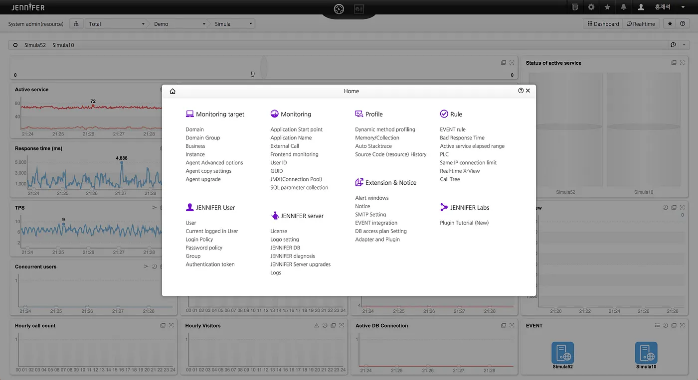
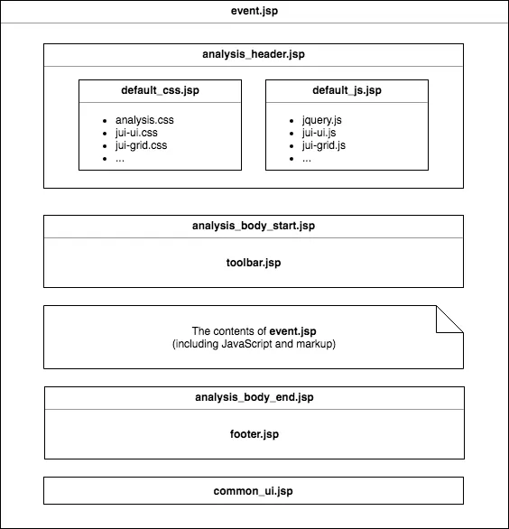
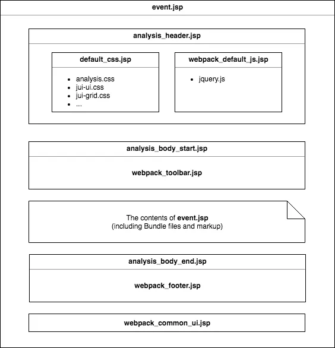
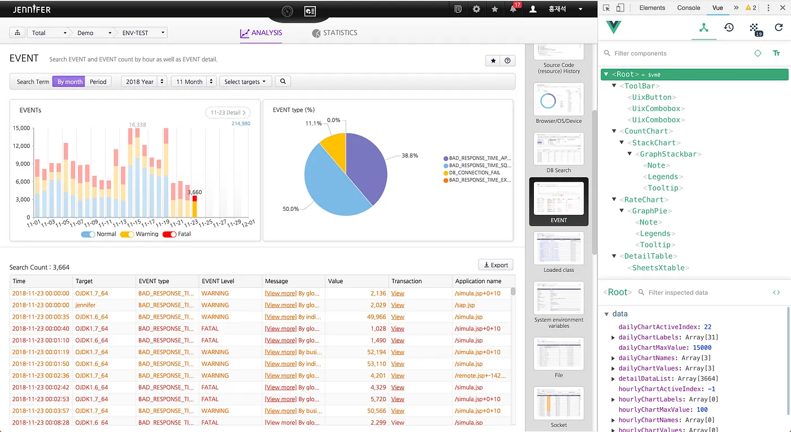

필자의 올해 목표 중 하나는 오랜기간 조금씩 진행해왔던 제니퍼 뷰서버 플랫폼화를 마무리하는 것이었다. 기획했던 플랫폼 요소는 여러가지가 있지만 그 중에서도 제니퍼 화면을 독립적인 개발환경에서 구현할 수 있게 하는 기능이 제일 중요했다. 그래서 생각해낸 것이 서버 환경은 스프링부트로 심플하게 구성하고, 모던한 프론트엔드 개발을 위해 모듈 번들러로 웹팩을 선택했다. 관련해서는 필자가 쓴 [“Webpack+SpringBoot 기반의 프론트엔드 개발 환경 구축하기”](/blog/2017-08-17-webpack-springboot-starter/index.mdx)를 참고하자.

새로 갖춰진 개발환경에서 기존의 제니퍼 뷰서버 플러그인 중 일부를 테스트 삼아 마이그레이션 해보니까 나름 신선하더라. 기존의 JSP 템플릿에 마크업과 공존하고 있던 자바스크립트 코드는 ES6 스펙에 맞춰서 수정하고, 모듈 별로 분리를 하고나니 필자가 사용하고 있는 IntelliJ IDEA의 정적 코드 분석이나 메소드 힌트 같은 기능들을 제대로 활용할 수 있게 되었다. 요즘 같은 세상에서는 너무 당연한 것이지만 수년간 쌓아온 레거시란 벽은 이미 넘을 수 없을만큼 높아진 상태였다.

필자는 지난 8월에 [“레거시(Legacy) 시스템에 웹팩 개발환경 적용하기”](/blog/2018-08-22-applying-webpack-to-legacy/index.mdx)를 쓰면서 언젠가는 실무에 꼭 적용해보겠다는 다짐을 했었다. 그리고 얼마지나지 않아 여유 일정이 생겼고, 더 이상 미룰 수 없는 일이기에 바로 시작했다.

## (1) 마이그레이션 대상 선택하기

제니퍼 화면은 크게 메인 대시보드와 사용자정의 대시보드, 리얼타임, 분석, 통계, 관리, 보고서 템플릿, 사용자 메뉴로 나눌 수 있다. 참고로 사용자정의 대시보드와 보고서 템플릿은 화면 단위가 아니라 컴포넌트 단위의 기능으로 복잡하게 얽혀있어서 마이그레이션 대상에서 제외했다. 다음은 제니퍼에서 제공하는 타입 별 화면 개수이다.

> 메인 대시보드 6종, 리얼타임 8종, 분석 21종, 통계 6종, 관리 44종

제니퍼는 한달에 최소 두번 이상의 마이너 버전이 릴리즈 되는 온-프레미스(On-premise) 제품이다보니 문제가 되는 버전이 고객사에 설치되면 되돌리기가 쉽지 않다. 서비스형 제품처럼 피드백이 즉각적으로 나타나진 않지만 수없이 많은 과거 버전들 속에서 다양한 문제에 직면하게 된다. 필자는 지난 수년간 수많은 고객사에 설치되어 어느 정도 안정성이 확보된 85종의 화면들을 마이그레이션 해야한다.

## (2) 목표 설정하기

모든 일의 시작은 목표를 잘 정하는 것이다. 너무 당연한 말이지만 일의 규모가 크거나 앞에서 말한 것처럼 이미 검증된 일을 뒤엎고 새로운 것을 적용하는 일은 진행하는 사람이나 직책자 또는 구성원들에게 큰 부담을 안겨준다. 그래서 필자는 다음과 같은 목표를 정하고, 일의 당위성을 확보하기 위한 논리를 정리했다.

 1. 유닛 테스트와 스냅샷 테스트가 가능해야 함
 2. 툴에서 디버깅이 가능한 코드를 개발할 수 있어야 함
 3. 화면 단위로 프레임워크나 라이브러리를 자유롭게 사용할 수 있어야 함
 4. 마이그레이션 된 화면과 기존의 화면이 모두 잘 동작해야 함

4번에 대해 조금 더 설명을 하자면 한번에 모든 화면을 마이그레이션 할 수 있다면 정말 좋겠지만 현실적으로 불가능한 일이기 때문에 새로 갖춰진 개발환경에서는 기존의 화면과 마이그레이션 된 화면이 모두 잘 동작해야 한다.

## (3) 기술 스펙 정하기

목표 설정이 끝났으니 이제는 새로 갖춰질 개발환경의 기술 스펙을 정해야 한다. 본문에서는 각각의 기술 스펙에 대한 설명은 생략하겠으며, 서론에서도 언급한 필자가 작성한 글을 참고하면 도움이 될 것이다.

 1. 모듈 번들러 : webpack 4
 2. 개발환경 서버 : webpack-dev-server
 3. JavaScript 컴파일러 : babel 6
 4. JavaScript 프레임워크 : vuejs 2
 5. CSS 컴파일러 : sass
 6. 테스트 도구 : jest
 7. 기타 : eslint, prettier

## (4) 레이어 기반의 화면 정리하기

목표와 기술 스펙이 정해졌으니 현재 시점에서 바로 본론으로 넘어가야 하는데, 뜬금없이 레이어 기반의 화면에 대한 설명을 보게 되서 당혹스럽겠지만 제니퍼는 언제 어디서든 관리 화면을 띄울 수 있도록 레이어 기반으로 구현되었다.

즉, 마이그레이션 대상 화면의 절반이 레이어 기반인 것이다. 필자의 계획은 화면 단위(URL 별)로 엔트리를 설정하고, 공통 모듈을 제외한 아웃풋 파일들을 화면 별 디렉토리 안에 생성해두려고 했었다. 하지만 관리 화면들이 레이어 기반이기 때문에 시작부터 큰 난관에 부딪치게 되었다.



고민 끝에 필자는 모든 관리 화면을 iFrame 기반으로 변경하기로 했다. 물론 리소스 중복 로드에 따른 로딩 속도 문제나 컨텐츠에 따라 iFrame 크기를 유동적으로 변경해야 하는 등의 몇가지 문제점이 있었지만 어렵지 않게 해결할 수 있었다. 간단하게 정리하자면 다음과 같다.

 1. 관리 화면 특성상 다른 종류의 화면에 비해 공통 모듈이나 라이브러리를 적게 사용하기 때문에 마이그레이션이 완료되면 로딩 속도 문제가 어느 정도 개선될 것이다.
 2. [“iFrame Resizer”](https://github.com/davidjbradshaw/iframe-resizer)라는 완성도가 높은 라이브러리를 사용했기 때문에 컨텐츠에 따른 iFrame 크기 조절을 자연스럽게 처리 할 수 있었다.

참고로 페이지 기반으로 화면이 변경되면서 고정 크기의 윈도우 컴포넌트에서 벗어나 별도의 팝업이나 URL로 접근할 수 있게 되어 사용성이 많이 개선되었다.

## (5) 레이아웃 구조 살펴보기

제니퍼 화면은 JSTL 커스텀 태그로 공통 레이아웃을 화면 별로 구성하는데, 화면 타입 별로 조금씩 다르게 처리되어 있다. 문제는 마크업 뿐만이 아니라 템플릿, 자바스크립트, 스타일까지 함께 포함되어 있기 때문에 우선 자바스크립트를 분리하면서 ES6 모듈로 마이그레이션을 진행해야 한다.

일단 기존의 화면 타입 별 레이아웃에 대한 설명을 하자면 다음과 같다.

 1. 화면_타입_header.jsp : default_css.jsp와 default_js.jsp를 로드함
 2. 화면_타입_body_start.jsp : toolbar.jsp를 로드함
 3. 화면_타입_body.end.jsp : 화면 타입 별로 공통으로 사용되는 마크업과 스크립트가 들어가고, footer.jsp를 로드함
 4. common_ui.jsp : 제니퍼에서 사용되는 모든 컴포넌트들에 대한 템플릿과 스크립트가 포함되어 있음

다음은 화면 타입 별 레이아웃 내부에서 로드하는 공통 레이아웃에 대한 설명이다.

 1. default_css.jsp : 제니퍼 화면 구성에 필요한 css 파일과 JUI 라이브러리의 css 파일들을 로드함
 2. default_js.jsp : 제니퍼 캔버스 차트와 유틸리티 js 파일과 jQuery나 JUI 같은 라이브러리의 js 파일들을 로드함
 3. toolbar.jsp : 제니퍼 화면 상단에 보이는 툴바 영역에 대한 마크업과 스크립트가 포함되어 있음

예를 들어 EVENT 분석 화면은 /analysis/event으로 접근할 수 있는데, 해당 JSP 템플릿 파일은 /WEB-INF/jsp/analysis/event.jsp에 위치한다.



## (6) 레이아웃 구조 분리하기

일단 default_css.jsp는 화면 별 스타일과 ES6로 마이그레이션 된 컴포넌트 스타일만 분리했기 때문에 생각보다 간단하게 끝났다. 하지만 문제는 default_js.jsp와 toolbar.jsp, analysis_body_end.jsp, common_ui.jsp였다.

기존의 화면들은 잘 동작해야하므로 그대로 두고, 마이그레이션 대상 화면에 대해서만 레이아웃을 다르게 구성하기로 했다. 필자는 모듈 번들러로 웹팩을 선택했기 때문에 development 모드와 production 모드에 따라 output.path를 다르게 생성했다.

 1. development 모드 : $프로젝트_디렉토리/.webpack/bundles
 2. production 모드 : $프로젝트_디렉토리/src/main/webapp/bundles

JSP 템플릿에서는 pageConext 내장 객체를 사용할 수 있는데, 요청 헤더 정보 중에 request.getServletPath() 메소드를 사용하여, 화면 타입과 화면 이름을 분류했다. 제니퍼 뷰서버는 다음과 같이 단순한 URL 구조를 가진다.

> URL : http://127.0.0.1:8080/analysis/event<br/>
(화면 타입은 analysis, 화면 이름은 event)

만약에 development 모드이고, EVENT 분석 화면이라면 $프로젝트_디렉토리/.webpack/bundles/analysis/event에 디렉토리가 생성된다. 사용자가 특정 화면에 접근했을 때, 앞에서 말한 pageContext 내장 객체를 사용하여 화면 타입과 화면 이름을 분류하고, output.path에 해당 디렉토리가 존재하는지 확인한다. 만약에 디렉토리가 존재한다면 마이그레이션 대상 화면이라고 간주하고, 다음과 같은 레이아웃 구조로 변경한다.



기존에는 모든 화면에서 default_js.jsp에 정의된 js 파일들을 로드했었다. jquery나 moment, lodash 같은 유명한 라이브러리도 포함되어 있고, 제니퍼 캔버스 차트나 유틸리티, JUI 등 내부에서 사용되는 모듈들도 포함된다. 필자는 마이그레이션 대상 화면에서 의존성이 너무 높은 jquery를 제외하고, 번들 파일들만 로드할 수 있도록 제니퍼 뷰서버를 대대적으로 수정하였다.

## (7) 웹팩 기본 설정하기

본문에서는 웹팩 설정 방법에 대해서 자세히 다루지는 않고, 중요하다고 생각하는 부분만 짚고 넘어가려고 한다. 먼저 모드에 따라 output.path를 다르게 설정해주고, 마이그레이션 대상 화면은 계속 늘어날 것이기 때문에 entry를 멀티로 설정해야 한다.

```javascript
const path = require('path');

module.exports = (env) => {
  const clientPath = path.resolve(__dirname, 'src/main/client');
  const outputPath = path.resolve(__dirname, (env == 'production') ?
                                  'src/main/webapp' : '.webpack');
  const publicPath = '/bundles';

  return {
        mode: env,
        entry: {
          'analysis/event/app': `${clientPath}/analysis/event/index.js`,
          'realtime/event/app': `${clientPath}/realtime/event/index.js`,
          ...
        },
        output: {
            path: outputPath + publicPath,
            publicPath: publicPath,
            filename: '[name].js'
        },
    ...
  }
}
```

먼저 clientPath에는 JSP 템플릿 파일에서 분리한 자바스크립트 코드를 ES6 모듈로 마이그레이션 한 index.js 파일들이 위치한다. 화면 별 index.js 파일들은 entry가 되는데, 여기서 entry 키에 주목하자.

output.filename이 [name].js로 설정되어 있는데, [name]은 entry 키로 치환되어 output.path 디렉토리에 생성된다. 만약에 analysis/event/index.js 파일을 production 모드에서 빌드를 하면 번들링 된 파일 경로는 다음과 같다.

> $프로젝트_디렉토리/src/main/webapp/bundles/analysis/event/app.js

참고로 output.publicPath를 /bundles로 설정했기 때문에 웹에서는 다음과 같이 접근할 수 있다.

> http://127.0.0.1:8080/bundles/analysis/event/app.js

이제 entry 모듈에서 화면 별로 필요한 라이브러리만 import해서 사용할 수 있게 되었다. 물론 jquery는 여전히 webpack_default_js.jsp에서 로드되고 있기 때문에 다음 설정을 통해서 번들 파일에 포함되지 않게 해야한다.

```javascript
...
return {
  ...
  externals: {
      jquery: 'jQuery'
  },
  ...
}
```

## (8) 웹팩 개발서버 설정하기

필자는 development 모드일 때, webpack-dev-server를 사용하기로 결정했는데, 이유는 HMR(Hot Module Replacement)를 적용해보고 싶었기 때문이다. 하지만 몇가지 문제로 인해 현재는 Live-Reload만 적용한 상태이다.

webpack-dev-server는 번들 파일을 메모리 상에서 제공하기 때문에 output.path로 설정한 .webpack 디렉토리가 필요없다. 하지만 특정 화면으로 접근했을 때, 제니퍼 뷰서버가 마이그레이션 대상 화면인지 판단하기 위해서는 실제 파일이 필요했고, JSP 템플릿에서 로드해야 하는 파일들은 화면 별로 조금씩 다르기 때문에 구분이 필요했다. 그래서 마음에 들진 않지만 webpack 명령어를 함께 사용했다.

> webpack --watch --env=development & webpack-dev-server --env=development

실은 webpack-dev-server가 컴파일 할 때, 번들 파일 경로를 얻어오는 방법을 열심히 알아봤으나 아직까지도 답을 찾지 못했다. 하지만 Express는 webpack-dev-server를 미들웨어로 추가하면, 번들 파일 경로를 가지고 올 수 있어서 참 아쉬웠다. (제니퍼 뷰서버는 자바 스프링을 사용함 ㅜㅜ)

```javascript
...
return {
  ...
  devServer: {
      host: '127.0.0.1',
      port: 8081,
      progress: true,
      inline: true,
      hot: false,
      proxy: [{
          context: [ '**', '!/ws/**' ],
          target: 'http://127.0.0.1:8080'
      }, {
          context: [ '/ws/**' ],
          target: 'ws://127.0.0.1:8080',
          ws: true
      }]
  },
  ...
}
```

webpack-dev-server 포트로 제니퍼 화면에 접근했을 때, 웹소켓으로 데이터를 가져오는 대시보드가 제대로 동작하지 않았다. 그래서 조금 헤맸었는데, http와 ws 프록시 컨텍스트만 겹치지 않게 설정하면 해결되는 문제였다.

## (9) 공통 모듈 청크하기

앞에서 entry를 멀티로 설정하여 화면 별로 번들 파일을 생성하는 방법에 대해 알아봤다. 하지만 네비게이션 바나 사용자 메뉴, 알림 등 모든 화면에서 공통으로 사용되는 기능이나 유틸리티 모듈들은 어떻게 번들링 될까? 웹팩 기반으로 개발하는 사람은 누구나 알고 있는 splitChunks 옵션을 사용하면 되는데, 일단 다음 설정을 보자.

```javascript
module.exports = (env) => {
  const clientPath = path.resolve(__dirname, 'src/main/client');
  ...
  return {
    ...
    optimization: {
      splitChunks: {
          cacheGroups: {
              common: {
                  test: clientPath + '/common',
                  chunks: 'all',
                  name: 'base/common'
              },
              modules: {
                  test: clientPath + '/modules',
                  chunks: 'all',
                  name: 'base/modules'
              }
          }
      },
      ...
    }
  }
}
```

여기서 중요한 부분은 cacheGroups 모듈의 name 설정 부분인데, 앞에서 설명한 output.filename의 [name]과 치환되어 output.path 디렉토리에 번들 파일이 생성되는 것이다. production 모드일 때, 번들링 된 파일 경로는 다음과 같다.

> $프로젝트_디렉토리/src/main/webapp/bundles/base/common.js<br/>
$프로젝트_디렉토리/src/main/webapp/bundles/base/modules.js

## (10) 이미지 파일 관리하기

보통은 스프라이트 이미지를 사용하는데, 부득이하게 특정 스타일에 단일 이미지를 사용해야 하는 경우가 종종 발생한다. 그래서 필자는 웹팩으로 번들링 할 때, development 모드에서는 url-loader를 사용하고, production 모드에서는 file-loader를 사용했다.

이미지가 base64로 인코딩되서 CSS 파일에 포함되기 때문에 개발할 때는 매우 편리하지만 용량이 많이 커지는 문제가 있다. 그래서 개발이 완료되면 file-loader를 사용하기로 했다. 다만 여기서 주의할 점은 이미지 파일들은 화면 별 디렉토리에 포함되어 있지만 배포 할때는 다른 화면의 이미지 파일과 함께 동일한 디렉토리에 복사된다.

```javascript
...
return {
  ...
  module: {
    rules: [].concat([ env == 'production' ?
        {
            test: /\.(jpe?g|png|gif|svg)$/i,
            use: [{
                loader: 'file-loader',
                options: {
                    name: '[hash].[ext]',
                    outputPath: '/images',
                    publicPath: '/bundles/images'
                }
            }]
        } : {
            test: /\.(jpe?g|png|gif|svg)$/i,
            use: [{
                loader: 'url-loader',
                options: {
                    limit: 1024 * 1024
                }
            }]
        }
    ])
  },
  ...
}
```

이미지가 복사되는 디렉토리는 앞에서 설명한 output.path에 options.outputPath가 더해진 경로이므로 다소 헷갈릴 수도 있기 때문에 주의해서 설정해야 한다.

> $프로젝트_디렉토리/src/main/webapp/bundles/images

모든 화면의 이미지 파일이 동일한 디렉토리에 복사되기 때문에 파일명이 겹치지 않도록 options.name을 [name] 대신 [hash]로 변경하였다. 그리고 options.publicPath를 /bundles/images로 설정했기 때문에 웹에서는 다음과 같이 접근할 수 있다.

> http://127.0.0.1:8080/bundles/images/[hash].jpg

## (11) JavaScript 프레임워크 선택하기

Vue.js를 선택한 이유는 여러가지가 있는데, 일단 필자는 템플릿 방식을 선호한다. 2.x 버전부터 render 함수를 지원하지만 이건 개인 취향이니 그냥 넘어가고, 가장 큰 이유는 기존의 레거시 화면과 공존해야 하는 특수한 경우라서 경량 프레임워크를 선택하는 것이 옳은 판단이라고 생각했다.

JSP 템플릿에 포함된 자바스크립트 코드는 ES6 모듈로 마이그레이션 했지만 여전히 마크업 코드는 남아있었다. 하지만 싱글 파일 컴포넌트에 거의 수정하지 않고 옮길 수 있었기 때문에 마이그레이션 속도가 많이 향상되었다. 참고로 제니퍼 화면은 서버에서 넘겨주는 필수 데이터들이 많아서 JSP 같은 서버 템플릿을 완전히 제거할 수는 없었다. 그래서 최소한의 마크업만 남겨두고, 최대한 뷰 컴포넌트 단위로 화면을 분리해서 개발했다.

어차피 테스트가 가능한 코드를 만드는 것이 최종 목표이기 때문에 뷰 컴포넌트 단위로 테스트를 진행하기로 결정했다. 그리고 필자는 Vue.js 하위 프로젝트인 “vue-test-utils”를 아주 잘 사용하고 있다.

## (12) 뷰 컴포넌트로 마이그레이션 하기

제니퍼 화면에서는 자체 개발한 수많은 컴포넌트들을 사용한다. 크게 대시보드와 리얼타임 화면에서 사용되는 캔버스 차트가 있고, 분석이나 통계, 보고서 템플릿 화면에서 사용되는 SVG 차트가 있다. 그리고 모든 화면에서 그리드, 달력, 콤보박스 등등 수많은 컴포넌트들을 두루 사용하고 있다. JUI 라이브러리는 그 중에서 일부를 공개한 것이다.

막상 Vue.js로 화면 개발을 하다보니 ES6 모듈로 마이그레이션 된 기존의 컴포넌트들을 사용하기가 어려웠다. 아무래도 제니퍼 화면은 컴포넌트 비중이 높기 때문에 Vue.js가 제공하는 기능들을 제대로 활용하지 못했다. 그래서 먼저 JUI 라이브러리를 뷰 컴포넌트로 마이그레이션 하기로 결정했다. 불행(?) 중 다행으로 차트는 몇달 전부터 시작해서 어느 정도 마무리가 된 상태였다.

JUI 라이브러리가 가지는 기존의 색은 모두 버리고, 최대한 Vue.js 특성에 맞게 마이그레이션 하려고 신경썼다. 쉽지 않은 일이었지만 결국 차트(23종), 그리드(2종), UI(13종)의 뷰 컴포넌트를 제공하게 되었고, GitHub에 프로젝트를 공개했다. 현재는 제니퍼 화면에 의존성이 높은 전용 컴포넌트들을 마이그레이션 하고 있다.



## (13) Jest 설정시 주의사항

테스트 프레임워크는 요즘 많이 사용하고 있는 Jest를 선택했는데, 기본 설정을 하는 과정에서 몇일동안 삽질한 부분만 짧막하게 짚고 넘어가려고 한다. 만약에 테스트 대상 모듈에서 NPM으로 설치한 모듈을 사용하고 있다면 SyntaxError: Unexpected identifier 에러가 발생한다.

필자가 공식 매뉴얼만 제대로 읽었다면 쉽게 해결할 수 있는 간단한 문제였다. 그것은 바로 transformIgnorePatterns 옵션의 기본값이 [“/node_modules/”]로 설정되어 있기 때문이다. 간단하게 빈 배열로 변경하거나 각자의 프로젝트에 맞는 패턴을 설정하면 된다.

## (14) 번들 파일 배포하기

일반적인 서비스라면 CDN에 번들 파일들을 업로드하는 형태의 배포 방법을 선택할 수 있지만 제니퍼 뷰서버는 정적 리소스를 WAR 파일에 묶어서 배포한다. 참고로 제니퍼는 모든 프로젝트를 메이븐으로 관리하기 때문에 빌드시 NPM 명령어를 실행할 수 있는 frontend-maven-plugin을 사용하기로 결정했다.

다음은 package.json에 명시된 모듈들을 먼저 설치하고, 웹팩을 production 모드로 빌드하게 하는 설정이다.

```xml
<plugin>
    <groupId>com.github.eirslett</groupId>
    <artifactId>frontend-maven-plugin</artifactId>
    <version>1.6</version>
    <executions>
        <execution>
            <id>install node and npm</id>
            <goals>
                <goal>install-node-and-npm</goal>
            </goals>
            <phase>generate-resources</phase>
        </execution>
        <execution>
            <id>npm install</id>
            <goals>
                <goal>npm</goal>
            </goals>
            <configuration>
                <arguments>install</arguments>
            </configuration>
        </execution>
        <execution>
            <id>npm build</id>
            <goals>
                <goal>npm</goal>
            </goals>
            <configuration>
                <arguments>run dist</arguments>
            </configuration>
        </execution>
    </executions>
    <configuration>
        <nodeVersion>v10.10.0</nodeVersion>
        <npmVersion>6.4.1</npmVersion>
    </configuration>
</plugin>
```

## 글을 마치며…

결과는 만족스러웠지만 조금만 더 빨리 시작했으면 좋았을텐데, 후회도 아쉬움도 많이 남는 일이었다. 일을 진행하면서 문제가 생겨 몇번의 핫픽스 버전을 릴리즈 했었다. 그만큼 레거시 시스템을 엎는다는건 조심스럽고 예민한 일이다. 하지만 앞으로 몇년을 생각하면 언젠가는 해야만 하는 일이다. 늦으면 늦을수록 위험부담이 커지기 때문에 기회가 오면 바로 시작해야 한다.