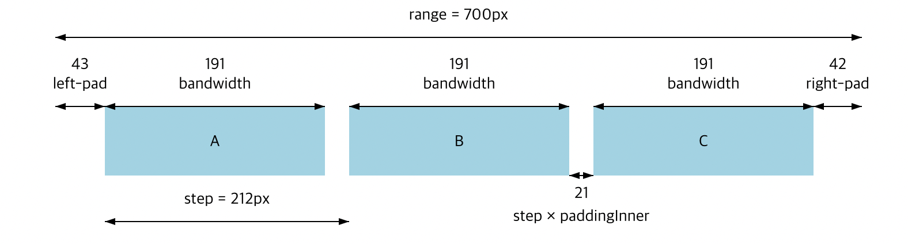
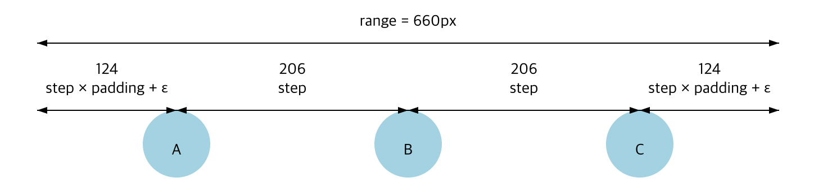
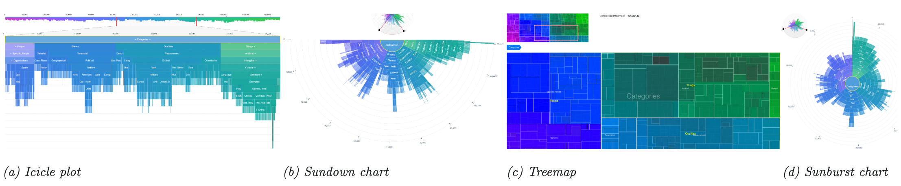

import Linear from '../../src/components/D3Scale/Linear';
import Power from '../../src/components/D3Scale/Power.tsx';
import Log from '../../src/components/D3Scale/Log.tsx';
import Band from '../../src/components/D3Scale/Band.tsx';
import Point from '../../src/components/D3Scale/Point.tsx';
import Time from '../../src/components/D3Scale/Time.tsx';
import Sequential from '../../src/components/D3Scale/Sequential.tsx';
import Diverging from '../../src/components/D3Scale/Diverging.tsx';
import Radial from '../../src/components/D3Scale/Radial.tsx';
import Ordinal from '../../src/components/D3Scale/Ordinal.tsx';
import Threshold from '../../src/components/D3Scale/Threshold.tsx';
import Quantile from '../../src/components/D3Scale/Quantile.tsx';
import Quantize from '../../src/components/D3Scale/Quantize.tsx';
import './index.css';

## 개요

D3 스케일(=척도)은 시각화의 기본 작업을 위한 편리한 추상화 모델입니다.
추상 데이터의 차원을 시각적 표현으로 매핑합니다.
예를 들어 산점도 차트에서 x축과 y축에 대한 값을 픽셀 단위로 변경하는 것처럼 정량적 데이터를 좌표 값으로 변경하는 데 가장 많이 사용됩니다.
스케일은 색상, 선, 폭 또는 심볼 크기와 같은 거의 모든 시각적 인코딩을 나타낼 수 있습니다.
또한 정의된 범주형 데이터 또는 구분이 필요한 개별 데이터와 같은 거의 모든 유형의 데이터와 함께 사용할 수 있습니다.

## scaleLinear (선형)

가장 보편적으로 사용하는 스케일이며, 다른 스케일과 마찬가지로 domain(정의역)과 range(치역)만 기억하면 됩니다.
domain은 입력 값, range는 입력 값에 대응하는 출력 값입니다. 
invert는 반대로 출력 값을 입력 값으로 넣으면 원래의 입력 값을 반환하는 역함수입니다.

> y = mx + b

```typescript
const func = scaleLinear().domain([0, 10]).range([0, 80]);
func(2); // return 16;
func(5); // return 40;
func(6); // return 48
func(15); // return 120
```

<Linear></Linear>

## scalePower (지수)

결과 값을 보간하기 위해 제공되는 함수이며, 지수(exponent)에 따라 결과 값을 서서히 늘리거나 줄일 수 있습니다.

> y = mx^k + b

거듭제곱을 하다보면 기하급수적으로 값이 커지기 때문에 D3 스케일에서는 domain 범위에 맞게 별도의 보정을 합니다.
(Math.pow(입력값, exponent) / Math.pow(최대값, exponent - 1))

```typescript
const func = scaleLinear().domain([0, 100]).range([10, 50]);
func(0); // return 10;
func(25); // return 20;
func(50); // return 30
func(75); // return 40
func(100); // return 50

const func2 = scalePow().exponent(0.5).domain([0, 100]).range([10, 50]);
const func3 = scaleSqrt().domain([0, 100]).range([10, 50]);
const func4 = scalePow().exponent(2).domain([0, 100]).range([10, 50]);
```

<Power></Power>

## scaleLog, scaleSymlog (로그)

최대값이 극단적으로 클 경우, 결과값의 분포를 비교적 완만하게 보정해주는 스케일입니다.
Symlog 함수는 대칭 로그를 의미하며, 양수 및 음수 값을 허용합니다.

> y = mlog(x) + b

```typescript
const data = [ 10, 100, 10000, 1000000 ];
```

<Log></Log>

## scaleBand (밴드)

Linear 스케일과 비슷하게 동작하지만 domain 사이에 여백(padding)을 비율로 설정할 수 있으며, 일반적으로 바나 컬럼 차트를 구현할 때, 사용하는 목적으로 만들어졌습니다.



```typescript
const DOMAIN = [0, 1, 2, 3];
const RANGE = [0, 400];

const func1 = scaleBand<number>().domain(DOMAIN).range(RANGE);
const func2 = scaleBand<number>().domain(DOMAIN).range(RANGE)
.paddingInner(0.6);
const func3 = scaleBand<number>().domain(DOMAIN).range(RANGE)
.paddingOuter(0.2).align(0.5); // 0이면 맨 왼쪽으로 당김
```

<Band></Band>

## scalePoint (점)

Band 스케일과 달리 domain 개별로 여백이 적용되며, bandwidth 개념이 없고, (최대 range/domain 수)로 시작점을 정합니다.



<Point></Point>

## scaleTime (시간)

Linear 스케일과 동일하지만 domain 범위를 Date 객체로 정할 수 있습니다.
앞에서 설명한 ticks 함수를 사용하여 X축을 구현하고, 마우스 오버시 구해지는 실제 좌표값을 invert 함수로 넘겨서 현재 시간을 구합니다.

```typescript
const now = Date.now();
const start = new Date(now - 1000 * 60 * 60);
const end = new Date(now);

const func = scaleTime().domain([start, end]).range([0, 600]);
```

<Time></Time>

## scaleSequential (연속)

보간기(Interpolator) 함수로 정의된 연속된 값에 매핑합니다.
고유한 보간기 기능을 정의하거나 내장된 D3 보간기 기능을 사용할 수 있습니다.
일반적으로 숫자값의 연속 간격을 일련의 색상으로 매핑하는데 유용합니다.

> scaleSequential 함수는 선형적으로 매핑하는데, 앞에서 설명한 다른 스케일 방식으로 매핑하는 함수도 제공됩니다.
> (scaleSequentialLog, scaleSequentialSymlog, scaleSequentialPow, scaleSequentialSqrt, scaleSequentialQuantile)

```typescript
import { interpolateRainbow } from 'd3-scale-chromatic';

const func = scaleSequential() .domain([0, 100])
.interpolator(interpolateRainbow);
```

<Sequential></Sequential>

## scaleDiverging (양방향)

양수와 음수, 위쪽과 아래쪽의 두가지 반대 방향으로 진행되는 현상을 시각화하는데 도움이 됩니다.

```typescript
import { interpolateRdBu } from 'd3-scale-chromatic';

const func = scaleDiverging<string>() .domain([-50, 0, 50])
.interpolator(interpolateRdBu);
```

<Diverging></Diverging>

## scaleRadial (방사형)

입력 값이 제곱된 출력 값에 선형적으로 대응하도록 범위가 내부적으로 제곱되는 Linear 스케일의 변형입니다.

```typescript
const innerRadius = 80;
const outerRadius = 220;

const x = scaleBand() .domain(data.map((row) => row.name))
.range([0, 2 * Math.PI]);

const y = scaleRadial().domain([0, 1000])
.range([innerRadius, outerRadius]);

const z = scaleSequential() .domain([0, 2 * Math.PI])
.interpolator(interpolateRainbow);
```

<Radial></Radial>

## scaleOrdinal (서수)

지정된 domain과 range를 갖는 순서를 나타내는 스케일을 생성하고 반환하는 데 사용됩니다.

```typescript
const func = scaleOrdinal<number, string>() .domain([0, 1])
.range(['white', 'pink', 'red']);

func(0); // white
func(1); // pink
func(2); // red
func(3); // white
```

<Ordinal></Ordinal>

## scaleThreshold (임계점)

결과 값을 구분하는 절단 값(=domain)을 직접 지정할 수 있습니다.

```typescript
const linear = scaleLinear<string>() .domain([0, 100000])
.range(['white', 'red']);

// 10000보다 작으면 white, 100000보다 크면 red, 나머지는 pink로 구분
const threshold = scaleThreshold<number, string>() .domain([10000, 100000])
.range(['white', 'pink', 'red']);
```

<Threshold></Threshold>

## scaleQuantile (분위수)

domain을 동일한 절대 빈도의 간격으로 분할합니다. 분할 수는 range에 정의된 값들의 수와 같습니다.

```typescript
// 100개의 데이터를 균등하게 나눠서 값의 크기에 맞게 분류함

const sampleData: number[] = [ 11002, 29017, 21699, 47058, 24001, 6000, ... ];
const quantile = scaleQuantile<string>() .domain(sampleData)
.range(['white', 'pink', 'red']);
```

<Quantile></Quantile>

## scaleQuantize (양자화)

domain 범위에서 임계값 선택을 처리하고, range에 정의된 값들의 수만큼 규칙적인 간격으로 세분화합니다.

```typescript
// 0~100192 white, 100193~200384 pink, 200385~300577 red

const quantize = scaleQuantize<string>() .domain([0, 300577])
.range(['white', 'pink', 'red']);
```

<Quantize></Quantize>

## 결론

제니퍼5 안에는 한정된 스케일 종류로 구현된 차트와 컴포넌트 등이 존재합니다.
다만 그때그때 상황에 맞게 구현했으며, 어떤 스케일이다라고 정의하지 않았을 뿐입니다. 지난 모니터링 스터디 준비를 하면서 몇가지 모니터링 제품을 살펴보았는데, 분위수나 로그 스케일 등을 사용하는 것을 목격한 적이 있습니다.
그동안 데이터를 표현하는데, 데이터를 왜곡하면 안된다는 이유로 여러가지 시도를 해보지 못한 것에 대해 아쉬움이 있었습니다.
이번에 D3 스케일을 살펴보고, 이해하는 과정에서 데이터 시각화에 대한 본질적인 목적, 이유에 대해 다시 한번 생각해보는 계기가 되었습니다.

## 참고

대부분의 데이터는 본질적으로 계층 구조를 가지고 있습니다. D3는 이런 계층적 구조를 시각화하기 위한 다양한 기능을 제공합니다.
해당 모듈이 제공하는 계층형 데이터 다이어그램의 종류는 3가지입니다. (노드-링크형, 인접형, 포함형)

노드-링크 형은 제니퍼5의 콜-트리와 같은 Indented Tree나 Tiny Tree, Dendrogram이 있다. 아래는 인접형과 포함형 다이어그램입니다.

