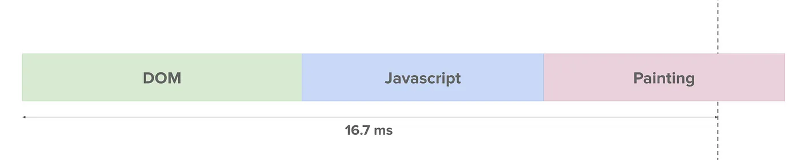
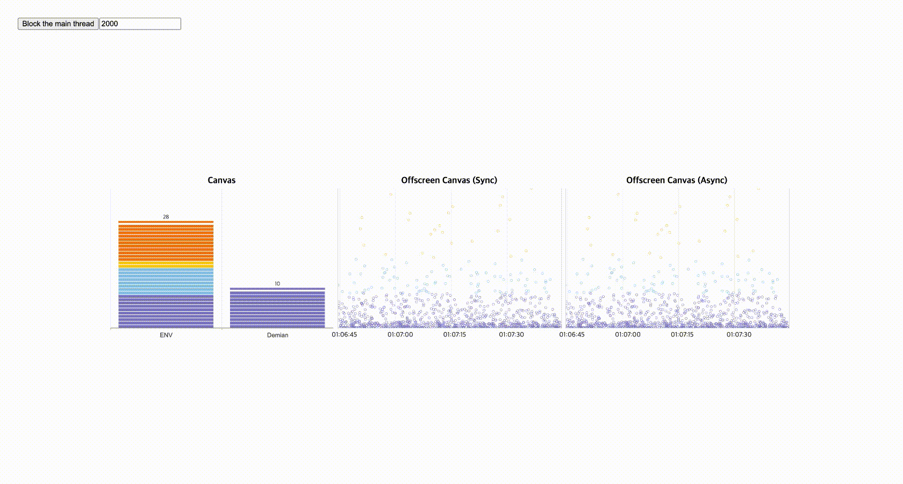
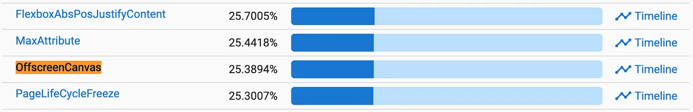

## 캔버스 애니메이션의 문제점

웹 개발시 다이나믹한 그래픽 처리가 필요하면 캔버스를 사용합니다.
이제 캔버스는 HTML 엘리먼트 중에서 사용 통계가 40%가 넘을 정도로 아주 범용적입니다.


캔버스는 애니메이션을 잘 처리하기 위한 목적으로 나온 태그이지만 현실은 다이나믹한 그래픽 처리에 어려움이 있습니다.

 * 자바스크립트 엔진과 렌더링 엔진 사이의 바인딩 오버헤드 발생
 * GPU 가속을 사용하더라도 Skia 내부의 오버헤드 발생
 * GPU 가속 쓰더라도 CPU를 써야하는 부분에서 페인팅 라이브러리 오버헤드 발생
 * 위 프로세스 처리 후 DOM 렌더링을 처리하기에도 벅찬 메인 스레드



프레임 드랍이 발생하지 않게 하기 위해서는 메인 스레드에서 1프레임(16.7ms) 안에 DOM, Javascript, Painting을 처리하고, 남는 시간에 캔버스 렌더링을 시도해야 합니다.
하지만 메인 스레드는 위 그림처럼 이미 많은 일을 하고 있는 경우가 많습니다.

## 기존의 문제점 개선 방법

### 풀 스크린으로 캔버스 렌더링하기

UI에 제약이 생기지만 캔버스를 풀 스크린으로 렌더링하면 핸들링할 Target DOM 이 없기 때문에 메인 스레드 자원을 더 사용할 수 있으며, GPU 가속까지 붙이면 성능을 개선할 수 있습니다.
애니메이션을 전체 화면에서 처리할 경우는 고려해볼 수 있는 선택지입니다.

### 백그라운드 캔버스

프리젠테이션용, 백그라운드용 캔버스를 두개 만듭니다.
백그라운드에서 여러 오브젝트를 다 그린 다음에 프레젠테이션 캔버스에 백그라운드 캔버스에서 그린 오브젝트를 가져와 한번에 한번에 엎어치기 하는 방식입니다. (현재 제니퍼 대시보드 차트에서도 사용되고 있는 방식)

### 오프스크린 캔버스를 사용한 개선

이미 사용되고 있는 WebWorker API를 통해 새로운 스레드 생성하여 렌더링 처리를 시도할 수 있으며, 캔버스를 DOM에서 분리할 수 있습니다.

#### 등장 배경

 * 자바스크립트 부하를 줄이기 위해 다른 스레드에서 실행할 수 있으면 좋겠음
 * 크진 않지만 스키아의 부하를 줄이기 위해 다른 스레드에서 실행하면 좋겠음
 * DOM 렌더링과 분리되면 좋겠음

#### 제약 사항

WebWorker에서는 직접적으로 DOM 엑세스가 불가능합니다.
캔버스가 HTML(DOM)이기에 메인 스레드에서 분리가 불가능합니다.(HTML은 JS, CSS 등 다른 자원에서 DOM 트리 접근시 싱크가 맞아야 하는데, 다른 스레드에서 처리하게 되면 싱크 이슈가 발생함)
React, Vue와 같이 Shadow DOM을 사용하게 되면 Atomic 하게 처리할 수 있습니다.

### 개발 방식

OffscreenCanvas 객체에서 만들어진 프레임을 동기적으로 화면에 보여주는 방법

 * 새 프레임이 컨텍스트에 렌더링이 되고나면, 가장 최근에 렌더링 된 이미지를 저장하는 transferToImageBitmap 메소드를 호출할 수 있습니다. 이 메소드는 다른 수 많은 Web API에서 사용되고 있는 ImageBitmap 객체를 리턴합니다.
 * &lt;canvas&gt; 엘리먼트를 여러개 생성하여 더블버퍼링 구현을 할 필요가 없으며, 프레젠테이션 캔버스에 비트맵 복사가 일어나지 않기 때문에 성능상 이점이 있습니다.

```javascript
var one = document.getElementById("one").getContext("bitmaprenderer");
var two = document.getElementById("two").getContext("bitmaprenderer");

var offscreen = new OffscreenCanvas(256, 256);
var gl = offscreen.getContext('webgl');

// ... gl 컨텍스트를 이용해 첫 번째 캔버스에 무언가를 그립니다 ...

// 첫 번째 캔버스에 렌더링을 수행합니다.
var bitmapOne = offscreen.transferToImageBitmap();
one.transferFromImageBitmap(bitmapOne);

// ... gl 컨텍스트를 이용해 두 번째 캔버스에 무언가를 그립니다 ...

// 두 번째 캔버스에 렌더링을 수행합니다.
var bitmapTwo = offscreen.transferToImageBitmap();
two.transferFromImageBitmap(bitmapTwo);
```

OffscreenCanvas 객체에서 만들어진 프레임을 비동기적으로 화면에 보여주는 방법

 * worker 또는 메인 스레드 위에서 &lt;canvas&gt; 엘리먼트의 transferControlToOffscreen 메소드를 호출하여, OffscreenCanvas 객체를 얻고, 해당 컨텍스트는 worker에서 새 프레임을 렌더링 할 수 있습니다.

```javascript
// main.js (메인 스레드 코드)
var htmlCanvas = document.getElementById("canvas");
var offscreen = htmlCanvas.transferControlToOffscreen();

var worker = new Worker("offscreencanvas.js");
worker.postMessage({canvas: offscreen}, [offscreen]);
```

```javascript
// offscreencanvas.js (worker 코드)
onmessage = function(evt) {
  const canvas = evt.data.canvas;
  const gl = canvas.getContext("webgl");

  function render(time) {
    // ... gl 컨텍스트를 이용해 무언가를 그립니다 ...
    requestAnimationFrame(render);
  }
  requestAnimationFrame(render);
};
```

### 데모

<a href="https://codesandbox.io/p/github/seogi1004/vue3-vite-starter/main" target="_blank">데모 화면</a>은 다음과 같이 구성되어 있습니다.

 * 일반 캔버스 샘플
 * 메인 스레드에서 동작하는 오프스크린 캔버스 샘플
 * worker에서 동작하는 오프스크린 캔버스 샘플



### 결론

 * 기존의 캔버스 관련 코드는 고치지 않고, WebWorker로만 옮겨가서 그대로 사용할 수 있습니다. 다만, 이벤트 처리와 데이터 가져오는 방식에 대한 고민이 필요합니다.
 * 메인 스레드와 worker 간의 데이터 전송을 위한 postMessage 함수 사용은 지양해야 합니다.
 * postMessage 함수 사용시 정책상의 이유로 데이터 복사본이 생성되는데, 이때 오버헤드가 발생합니다. (WebWorker API를 사용하지 않는 가장 큰 이유) 그래서 데이터 가져오는 코드를 worker 안에서 처리하면 좋습니다.
 * 웹팩 같은 번들러의 도움으로 worker 안에서 미리 작성한 모듈 재사용이 가능합니다.
 * Zero-copy 백그라운드 렌더링을 오프스크린 캔버스로 구현할 수 있습니다.
 * 크롬 69 버전과 파이어폭스 105 버전(지난 달인 9월 20일 릴리즈)부터 지원됩니다. 오프스크린 캔버스의 사용률은 공개된 이후부터 지속적으로 증가해서 현재는 25%가 넘었습니다. 많은 프론트엔드 개발자들이 캔버스의 문제점을 인식하고, 개선하기 위한 방법으로 오프스크린 캔버스를 선택한 것이라고 생각합니다.



 * Three.js에서 오프스크린 캔버스를 사용할 수 있습니다.
 * WebGL 및 WebXR을 오프스크린 캔버스로 구현할 수 있습니다.

### 참고

 * https://tv.naver.com/v/4578450
 * https://tech.kakao.com/2021/06/02/frontend-growth-09/