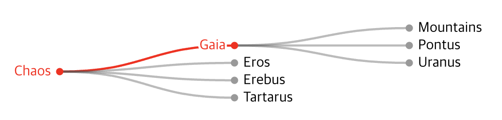
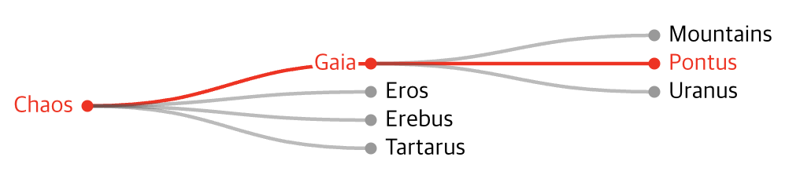
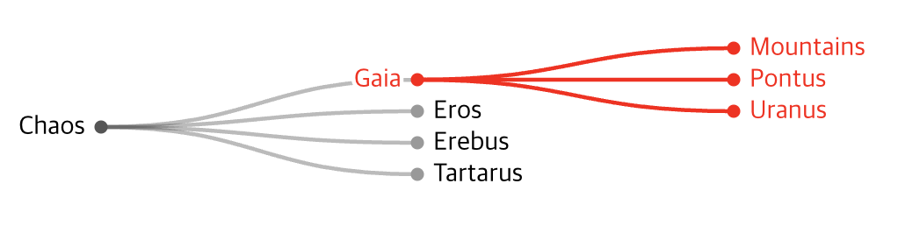
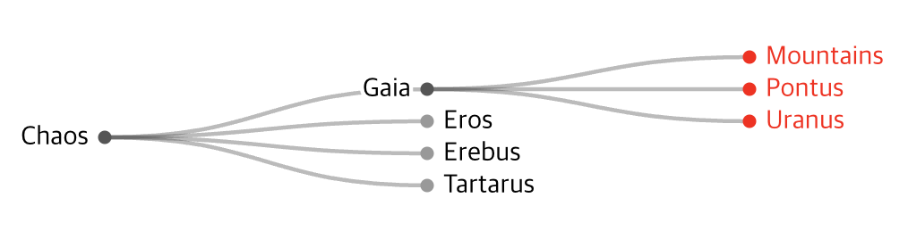
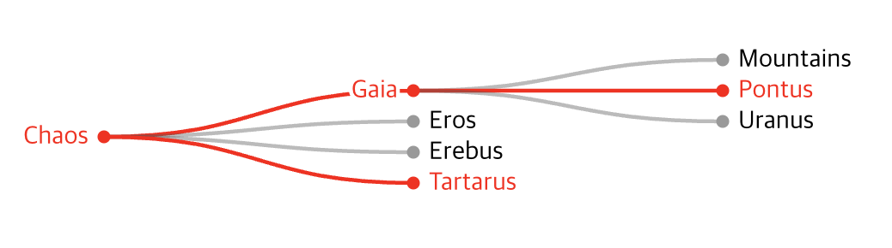

# Data Handling

## children을 포함하는 계층 데이터

D3에서 사용할 데이터를 정의할 때, 부모-자식 관계를 정하기 위해서 children을 반드시 포함시켜야 합니다.
children에 자식 노드를 추가하면서 계층 데이터 형태로 구성할 수 있습니다.

```typescript
interface TreeData {
    id: string;
    children?: TreeData[];
}

const TREE_DATA: TreeData = {
    id: 'Chaos',
    children: [
        {
            id: 'Gaia',
            children: [
                {
                    id: 'Mountains',
                },
                {
                    id: 'Pontus',
                },
                {
                    id: 'Uranus',
                },
            ],
        },
        {
            id: 'Eros',
        },
        {
            id: 'Erebus',
        },
        {
            id: 'Tartarus',
        },
    ],
};
```

### 기본적인 Hierarchy 객체 생성하기

hierarchy 함수를 호출하면 D3에서 정의한 HierarchyNode 타입의 객체가 리턴되며, 각각의 프로퍼티에 대한 설명은 다음과 같습니다.

- children : 자식 노드들
- data : 사용자가 정의한 데이터
- depth : 트리에서 자신의 노드의 깊이
- height : 자식 노드의 최대 깊이
- parent : 부모 노드 없으면 null

```typescript
const root = hierarchy<TreeData>(TREE_DATA);

console.log(root);
{
  children: [Node, Node, Node, Node],
  data: {id:  "Chaos", children: Array(4)}
  depth: 0,
  height: 2,
  parent: null
}
```

### 레이아웃 객체 생성하기

앞에서 생성한 객체를 가지고, D3에서 제공하는 레이아웃 객체를 생성할 수 있습니다.
아래는 트리를 그리기 위한 레이아웃 객체를 생성하는 코드이며, HierarchyNode 타입을 상속한 HierarchyPointNode 타입의 객체로 변경됩니다.

x, y 프로퍼티가 추가된 것을 확인할 수 있으며, 캔버스나 SVG로 무엇인가 그릴 때, 해당 값을 그대로 사용하면 됩니다.

HierarchyNode 타입을 상속하는 타입은 HierarchyPointNode 외에도 HierarchyRectangularNode, HierarchyCircularNode 타입이 있습니다.

```typescript
const treeLayout = tree().size([WIDTH, HEIGHT]);
treeLayout(root);

console.log(root);
{
  children: [Node, Node, Node, Node],
  data: {id:  "Chaos", children: Array(4)}
  depth: 0,
  height: 2,
  parent: null,
  x: 233.33333333333334,
  y: 0
}
```

## 로우셋을 계층 데이터로 변환하기

때로는 children 프로퍼티가 포함되어있지 않고, 부모 키만 알고 있는 데이터를 가지고 있을 수 있습니다.

```typescript
interface RowData1 {
    id: string;
    parentId?: string;
}
interface RowData2 {
    id2: string;
    pid?: string;
}

const ROW_DATA_1: RowData1[] = [
    { id: 'Chaos' },
    { id: 'Gaia', parentId: 'Chaos' },
    { id: 'Eros', parentId: 'Chaos' },
    { id: 'Erebus', parentId: 'Chaos' },
    { id: 'Tartarus', parentId: 'Chaos' },
    { id: 'Mountains', parentId: 'Gaia' },
    { id: 'Pontus', parentId: 'Gaia' },
    { id: 'Uranus', parentId: 'Gaia' },
];

const ROW_DATA_2: RowData2[] = [
    { id2: 'Chaos' },
    { id2: 'Gaia', pid: 'Chaos' },
    { id2: 'Eros', pid: 'Chaos' },
    { id2: 'Erebus', pid: 'Chaos' },
    { id2: 'Tartarus', pid: 'Chaos' },
    { id2: 'Mountains', pid: 'Gaia' },
    { id2: 'Pontus', pid: 'Gaia' },
    { id2: 'Uranus', pid: 'Gaia' },
];
```

D3에서는 children과 마찬가지로 id와 parentId 프로퍼티를 스스로 인식합니다.
stratify 함수를 사용하면 hierarchy 함수와 동일한 객체를 리턴하게 됩니다.

하지만 데이터 id와 parentId 프로퍼티가 포함되어 있지 않다면 id와 parentId 메소드를 통해 부모-자식 관계를 설정할 수 있습니다.

```typescript
const root1 = stratify<RowData1>()(ROW_DATA_1);
const root2 = stratify<RowData2>()
    .id((data) => data.id2)
    .parentId((data) => data.pid)(ROW_DATA_2);

console.log(root2);
{
  children: [Node, Node, Node, Node],
  data: {id:  "Chaos", children: Array(4)}
  depth: 0,
  height: 2,
  parent: null
}
```

## Hierarchy 객체의 메소드 소개

계층 데이터를 쉽게 핸들링할 수 있는 몇가지 메소드들을 소개합니다.

```typescript
const chaos = root2;
const gaia = chaos.children[0];
const pontus = chaos.children[0].children[1]
const tartarus = chaos.children[3];
```

### ancestors

자신을 포함하여 루트까지 모든 부모 노드의 배열을 반환합니다.

```typescript
gaia.ancestors();
```



```typescript
pontus.ancestors();
```



### descendants

자신을 포함하여 모든 자식 노드의 배열을 반환합니다.

```typescript
gaia.descendants();
```



### leaves

해당 노드의 자식 중에 자식이 없는 노드의 배열을 반환합니다

```typescript
gaia.leaves();
```



### path

해당 노드부터 대상 노드까지 연결된 모든 노드의 배열을 반환합니다.

:::tip 노드 순서
Tartarus -> Chaos -> Gaia -> Pontus
:::

```typescript
tartarus.path(pontus);
```



### links

해당 노드의 자식 링크를 나타내는 객체 배열을 반환합니다. 각 링크 객체의 target은 자식이고, source는 부모입니다.
gaia의 자식 노드인 mountains, pontus, uranus를 target으로 가진 HierarchyPointLink 타입을 가지는 배열을 리턴합니다.

앞에서 트리 레이아웃을 사용했기 때문에 HierarchyLink가 아닌 HierarchyPointLink 타입의 객체를 리턴합니다.
그 밖에도 HierarchyCircularLink, HierarchyRectangularLink 타입이 있습니다.

```typescript
gaia.links();
```

