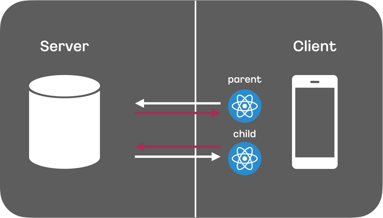
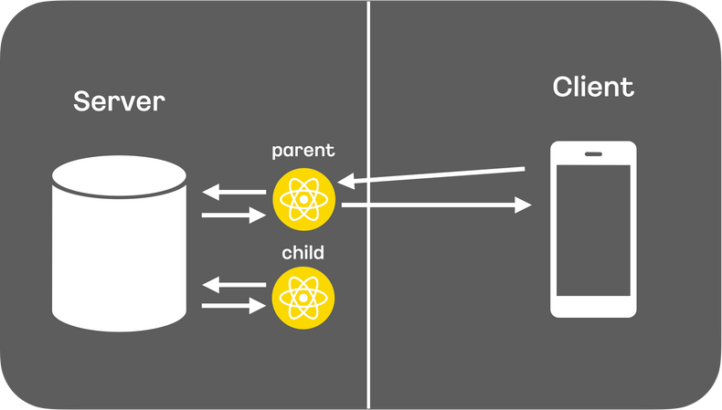

## 개요

2020년 12월 React 팀은 서버 주도(Server-Driven) 멘탈 모델로써 모던 UX를 가능하게 하는 것을 목표로 하는 [zero-bundle React 서버 컴포넌트](https://legacy.reactjs.org/blog/2020/12/21/data-fetching-with-react-server-components.html)를 시연했습니다. 이때 소개한 서버 컴포넌트는 서버 사이드 렌더링(SSR)과는 상당히 다르며 클라이언트 측 번들 크기를 매우 줄일 수 있다고 하였으며, 서버와 클라이언트(브라우저)가 React 애플리케이션을 서로 협력하여 렌더링 할 수 있게 됩니다.

그리고 2022년 10월 [Next.js Conf](https://nextjs.org/conf)에서 Next.js 13부터 React 서버 컴포넌트를 지원한다고 발표했습니다. 처음 서버 컴포넌트를 소개한 후, 시간이 꽤 지났음에도 불구하고, 아직도 실험적인 단계이긴 하지만 Next.js 기반으로 서버 컴포넌트를 구현해볼 수 있게 되었습니다. Next.js 관련해서는 [데이빗이 작성한 문서](https://www.notion.so/NextJS-43cf54bc542441a0ae33f5d005db18a5)를 참고하시면 됩니다.

# SSR의 한계

오늘날 자바스크립트의 서버 사이드 렌더링(SSR)은 초기 페이지 로드 시간을 개선하기 위한 차선책입니다. 컴포넌트의 자바스크립트는 서버에서 HTML 문자열로 렌더링됩니다. HTML은 브라우저에게 전달되고 나타나며, 빠른 FCP(First Contentful Paint) 혹은 LCP(Largest Contentful Paint)를 가지게 됩니다.

하지만 Hydration 단계를 통해 인터렉션이 가능해진 엘리먼트를 위해서는 여전히 자바스크립트가 필요합니다. 서버 사이드 렌더링은 일반적으로 최초 페이지 로드를 위해 사용되기 때문에 Hydration 이후에는 추가적으로 쓰이지 않습니다.

클라이언트에서의 Hydration을 전혀 하지 않고, React와 SSR만 가지고 애플리케이션을 만들 수도 있지만 애플리케이션에서 인터렉션을 많이 해야 하는 경우에는 어쩔 수 없이 클라이언트 측으로 코드를 보내야 합니다. 서버 컴포넌트의 하이브리드 모델은 이 선택을 컴포넌트 기준으로 가능하도록 해줍니다.

React의 서버 컴포넌트를 활용하면 컴포넌트들을 정기적으로 다시 받아올 수 있습니다. 새로운 데이터가 있을 때 서버에서 애플리케이션의 컴포넌트들을 리-렌더링 할 수 있으므로 클라이언트 측에 전송해야 하는 코드량을 줄일 수 있습니다.

SSR은 서버에서 HTML을 생성하고 클라이언트로 전송하는 방식입니다. SSR은 초기 로딩 속도를 높일 수 있지만 RSC는 더 많은 기능을 제공합니다.

> Hydration이란?
> 
> 1. 컴포넌트를 렌더링하고, 이벤트 핸들러를 연결하는 프로세스
> 2. 서버 단에서 렌더링한 정적 컨텐츠와 번들링 된 JS 파일을 클라이언트에게 보낸 뒤, 클라이언트 단에서 HTML 코드와 React인 JS 코드를 서로 매칭 시키는 과정

# RSC vs SSR

결론부터 말하자면 RSC는 SSR을 대체할 수 없습니다. SSR은 해당 페이지의 HTML 코드를 미리 빌드합니다. 이것은 SEO에 효과적이고, 사용자가 자바스크립트 코드를 다운받는 동안 해당 페이지의 내용을 미리 볼 수 있습니다. 즉, SSR은 해당 페이지 자체를 렌더링하는 것이고, 서버 컴포넌트는 각각의 컴포넌트마다 클라이언트 컴포넌트로 렌더링 할 것인지 서버 컴포넌트로 렌더링 할 것인지를 선택해야 합니다.

Next.js와 SSR의 차이점에 대해 [Dan과 Lauren의 talk](https://www.youtube.com/watch?v=TQQPAU21ZUw)에서 언급한 내용을 정리해 보면:

- 서버 컴포넌트의 코드는 클라이언트로 전달되지 않습니다. 하지만 서버 사이드 렌더링의 모든 컴포넌트의 코드는 자바스크립트 번들에 포함되어 클라이언트로 전송됩니다.
- 서버 컴포넌트는 페이지 레벨에 상관없이 모든 컴포넌트에서 서버에 접근 가능합니다. 하지만 Next.js의 경우 가장 top level의 페이지에서만 `getServerProps()`나 `getInitialProps()`로 서버에 접근 가능합니다.
- 서버 컴포넌트는 클라이언트 상태를 유지하며 re-fetch 될 수 있습니다. 서버 컴포넌트는 HTML이 아닌 특별한 형태로 컴포넌트를 전달하기 때문에 필요한 경우 포커스, 인풋 입력값 같은 클라이언트 상태를 유지하며 여러 번 데이터를 가져오고 리렌더링하여 전달할 수 있습니다. 하지만 SSR의 경우 HTML로 전달되기 때문에 새로운 re-fetch가 필요한 경우 HTML 전체를 다시 렌더링 해야 하며, 이로 인해 클라이언트 상태를 유지할 수 없습니다.

# 탄생 배경

React 팀은 다방면으로 성능 향상을 해왔으나 Data Fetching의 경우, 사용자와 개발자 경험 모두를 만족시킬 수있는 방법을 찾기가 어려웠습니다. React 컴포넌트의 비동기적 Data Fetching의 가장 큰 문제점은 클라이언트와 서버 간 요청의 High Latency와 연속된 클라이언트-서버 API 요청으로 발생하는 Waterfall이었습니다.



이와 같이 클라이언트 컴포넌트에서 비동기 Data Fetching은 클라이언트-서버의 Waterfall을 야기하고, 성능을 저하시키는 원인이 됩니다.

이를 위한 해결책으로 서버 컴포넌트가 탄생하게 되었으며, RSC는 용어 그대로 서버에서 동작하는 React 컴포넌트입니다. 서버 컴포넌트를 사용하면 컴포넌트 렌더링을 클라이언트가 아닌 서버에서 수행할 수 있습니다.

서버에서 렌더링을 수행하기 때문에 API를 통한 데이터 요청의 Latency를 줄일 수 있고, 클라이언트에서의 연속된 API 호출을 제거하여, 클라이언트-서버의 Waterfall을 막을 수 있습니다.



아쉽게도 서버 컴포넌트에서의 데이터 요청을 처리하여도 중첩된 컴포넌트에서의 여러 API 요청에 따른 네트워크 Waterfall은 여전히 존재합니다.

하지만 서버 컴포넌트는 서버에서 동작하고 렌더링 된다는 특성상 다양한 종류의 백엔드 리소스에 접근할수 있고, HTML이 아닌 ‘특별한’ 형태로 렌더링 되어 클라이언트에 전달되기 때문에 클라이언트로 전달되는 번들 사이즈 또한 감소시킬 수 있습니다.

# 서버 컴포넌트란?

React가 UI를 구축하는 방식을 바꾼 것과 유사하게, 서버와 클라이언트를 활용하는 하이브리드 애플리케이션을 구축하기 위한 새로운 사고 모델을 도입했습니다.

SPA의 경우처럼 전체 애플리케이션을 클라이언트 측에서 렌더링하는 대신, React는 이제 컴포넌트의 목적에 따라 렌더링할 위치를 선택할 수 있는 유연성을 제공합니다.


페이지를 더 작은 컴포넌트로 분할하면 대부분의 컴포넌트가 비대화형이며 서버에서 서버 컴포넌트로 렌더링 할 수 있음을 알 수 있습니다. 더 작은 인터랙티브 UI의 경우, 클라이언트 컴포넌트로 나타낼 수 있습니다. 이는 Next.js의 서버 우선 접근 방식과 일치합니다.

서버 컴포넌트의 특징을 정리하면 다음과 같습니다.

- 자유로운 서버 리소스 접근 : 데이터베이스, 파일 시스템 등등
- 제로 번들 사이즈 컴포넌트 : 서버 컴포넌트는 브라우저에 다운로드 되지 않고, 서버에서 미리 렌더링 된 정적 컨텐츠로 전달됨
- 자동 코드 분할 : 서버 컴포넌트에서 Import 되는 모든 클라이언트 컴포넌트를 코드 분할 포인트로 간주하기 때문에 Lazy 로드가 필요하지 않음

# 클라이언트와 서버 컴포넌트 구성하기

서버에서 React는 결과를 클라이언트로 보내기 전에 모든 서버 컴포넌트를 렌더링 합니다. 그리고 클라이언트에서 React는 클라이언트 컴포넌트를 렌더링하고 서버 컴포넌트의 렌더링 결과에 슬롯을 생성하여 서버와 클라이언트에서 수행한 작업을 병합합니다.

클라이언트 컴포넌트는 코드 상단에 ‘use client’ 디렉티브를 명시해야 합니다. 그리고 서버 컴포넌트를 import 할 수 없습니다.

대신 클라이언트 컴포넌트를 디자인 할 때, React 프로퍼티를 사용하여 서버 컴포넌트의 “holes”를 표시할 수 있습니다. 서버 컴포넌트는 서버에서 렌더링되고, 클라이언트 컴포넌트가 클라이언트에서 렌더링되면 서버 컴포넌트의 렌더링 된 결과로 “hole”이 채워집니다.

일반적인 패턴은 React의 children 프로퍼티를 사용하여 “hole”을 만드는 것입니다.

```typescript
'use client';
 
import { useState } from 'react';
 
export default function ExampleClientComponent({
  children,
}: {
  children: React.ReactNode;
}) {
  const [count, setCount] = useState(0);
 
  return (
    <>
      <button onClick={() => setCount(count + 1)}>{count}</button>
 
      {children}
    </>
  );
}
```

&lt;ExampleClientComponent&gt;는 자식 컴포넌트가 무엇인지 전혀 알지 못합니다. 사실, 이 컴포넌트의 관점에서는 자식들이 결국 서버 컴포넌트의 결과에 의해 채워질 것이라는 사실조차 알지 못합니다.

```typescript
// This pattern works:
// You can pass a Server Component as a child or prop of a
// Client Component.
import ExampleClientComponent from './example-client-component';
import ExampleServerComponent from './example-server-component';
 
// Pages in Next.js are Server Components by default
export default function Page() {
  return (
    <ExampleClientComponent>
      <ExampleServerComponent />
    </ExampleClientComponent>
  );
}
```

그리고 서버 컴포넌트는 클라이언트 컴포넌트를 Import 할 수 있지만 서버에서 클라이언트 컴포넌트로 전달되는 프로퍼티는 직렬화가 가능해야 합니다. 즉, 함수나 날짜 등과 같은 값은 클라이언트 컴포넌트에 직접 전달할 수 없습니다.

다음은 클라이언트와 서버 컴포넌트의 특징을 정리한 표입니다.

<table>
  <thead>
    <tr>
      <th width="70%">특징</th>
      <th width="15%">서버</th>
      <th width="15%">클라이언트</th>
    </tr>
  </thead>
  <tbody>
    <tr><td>데이터 가져오기</td><td>O</td><td>X</td></tr>
    <tr><td>백엔드 리소스에 직접 액세스 (직접)</td><td>O</td><td>X</td></tr>
    <tr><td>서버에 민감한 정보 보관 (액세스 토큰, API 키 등)</td><td>O</td><td>X</td></tr>
    <tr><td>서버에 대한 대규모 종속성 유지 / 클라이언트 측 자바스크립트 감소</td><td>O</td><td>X</td></tr>
    <tr><td>인터랙티브 및 이벤트 리스너 추가 (onClick, onChange 등)</td><td>X</td><td>O</td></tr>
    <tr><td>상태 및 라이프사이클 효과 사용 (useState, useReducer, useEffect 등)</td><td>X</td><td>O</td></tr>
    <tr><td>브라우저 전용 API 사용</td><td>X</td><td>O</td></tr>
    <tr><td>상태, 효과 또는 브라우저 전용 API에 의존하는 사용자 지정 후크 사용</td><td>X</td><td>O</td></tr>
    <tr><td>React 클래스 컴포넌트 사용</td><td>X</td><td>O</td></tr>
  </tbody>
</table>

# 데모 살펴보기

데모 화면은 Postgres DB에 저장된 사용자 목록을 가져와서 테이블 형태로 보여줍니다. 캐시 처리를 위해 Redis에 사용자 목록을 10초간 보관합니다.

```typescript
// lib/service.ts

import kv from "@vercel/kv";
import { sql } from "@vercel/postgres";

export interface User {
  id: number;
  name: string;
  image: string;
  email: string;
  createdAt: Date;
}

export async function getUsers(cacheKey: string) {
  const cachedData = await kv.get<User[]>(`users-${cacheKey}`);
  if (cachedData === null) {
    const data = await sql<User>`SELECT * FROM users`;
    await kv.set(`users-${cacheKey}`, JSON.stringify(data.rows), { ex: 10, nx: true })
    return data.rows;
  } else {
    return cachedData;
  }
}
```

```typescript
// app/api/route.ts

import { getUsers } from '@/lib/service';
import { NextResponse } from 'next/server';

export async function GET(request: Request) {
    return NextResponse.json({ users: await getUsers('client') });
}
```

아래는 클라이언트 컴포넌트로 구현된 테이블 컴포넌트입니다. 데이터를 가져오기 위해 /api/users를 호출하고, API 내부에는 앞에서 구현한 서비스 함수를 사용합니다.

```tsx
// components/client-table.tsx

'use client'

import type { User } from '@/lib/service';
import { useState, useEffect } from 'react';
import ReloadButton from './reload-button'
import TableHead from './table-head';
import TableRow from '@/components/table-row';

export default function ClientTable() {
  const [users, setUsers] = useState<User[]>([]);
  const [duration, setDuration] = useState<number>(0);
  const [loading, setLoading] = useState<boolean>(false);

  const loadData = () => {
    let startTime = Date.now();
    setLoading(true);
    fetch('/api/users')
      .then((res) => res.json())
      .then((data) => {
          setUsers(data.users)
          setDuration(Date.now() - startTime)
          setLoading(false)
      })
  }

  useEffect(() => {
    loadData();
  }, [])

  return (
    <div className="bg-white/30 p-12 shadow-xl ring-1 ring-gray-900/5 rounded-lg backdrop-blur-lg max-w-xl mx-auto w-full">
      <TableHead userCount={users.length} duration={duration}>
        <ReloadButton onClick={loadData} loading={loading} />
      </TableHead>
      <div className="divide-y divide-gray-900/5">
        {users.map((user, index) => (
          <TableRow key={index} user={user}></TableRow>
        ))}
      </div>
    </div>
  )
}
```

클라이언트 컴포넌트와 달리 API 호출을 위한 코드는 생략하고, 앞에서 구현한 서비스 함수를 바로 사용할 수 있습니다.

```tsx
// components/server-table.tsx

import { getUsers } from '@/lib/service';
import RefreshButton from './refresh-button'
import TableHead from './table-head';
import TableRow from './table-row';

export default async function ServerTable() {
  const startTime = Date.now()
  const users = await getUsers('server');
  const duration = Date.now() - startTime

  return (
    <div className="bg-white/30 p-12 shadow-xl ring-1 ring-gray-900/5 rounded-lg backdrop-blur-lg max-w-xl mx-auto w-full">
      <TableHead userCount={users.length} duration={duration}>
        <RefreshButton />
      </TableHead>
      <div className="divide-y divide-gray-900/5">
        {users.map((user, index) => (
          <TableRow key={index} user={user}></TableRow>
        ))}
      </div>
    </div>
  )
}
```

데모 화면과 소스 코드는 아래 링크를 통해 직접 확인할 수 있습니다.

 - [Demo](https://next.alvin.biz)
 - [GitHub](https://github.com/seogi1004/nextjs-rsc-starter)

# 글을 마치며

이번 스터디 발표 준비를 하면서 RSC에 대해 알아보고 이해하는 과정을 겪으면서 느꼈던 점은 언젠가 APM 에이전트 라인업에 RSC가 포함될 수도 있을 것 같다는 생각이 들었습니다.

지금처럼 프론트엔드와 백엔드 개발 영역의 구분이 명확하지 않았던 시절의 웹 개발을 했던 모습도 떠오릅니다. 물론 그때와 지금은 엄청난 차이가 있고, 자바스크립트는 웹 페이지의 인터랙티브 한 기능을 제공하기 위한 보조적인 역할만 했던 시기이기도 합니다.

RSC가 추구하는 방향성을 이해하려고 하다보니 문득 이런 생각이 들었습니다. 어쩌면 다시 옛날처럼 프론트엔드와 백엔드를 구분하지 않고 개발하는 시대가 올 수도 있겠구나. 다만, 과거와 달리 앞으로는 메인은 화면 개발이고, 서브로 렌더링 성능 개선을 위한 서버 개발을 해야하는 상황이 올 수도 있겠다는 생각을 했습니다. (프론트엔드 개발자 기준에서…)

앞으로 웹 생태계에 어떤 변화가 다가올지 알 수는 없지만 한가지 분명한 것은 RSC가 큰 영향을 줄 수 있을 것 같습니다. 그래서 꾸준한 관심과 기대를 가져볼만하다고 생각합니다.

# 참고 링크

문서를 읽고 이해하는 것보다 직접 구현해보는게 나을 것 같아서 이번에도 데모 개발에 시간을 많이 할애했습니다. 본문 내용의 대부분은 아래 문서를 인용한 것이니 참고하시길 바랍니다.

 - [Introducing Zero-Bundle-Size React Server Components](https://ko.legacy.reactjs.org/blog/2020/12/21/data-fetching-with-react-server-components.html)
 - [RFC: React Server Components](https://github.com/reactjs/rfcs/blob/main/text/0188-server-components.md)
 - [React Essentials](https://nextjs.org/docs/getting-started/react-essentials)
 - [How React server components work: an in-depth guide](https://www.plasmic.app/blog/how-react-server-components-work)
 - [React Server vs Client components in Next.js 13](https://kulkarniankita.com/react/react-server-client-components)
 - [React 18: 리액트 서버 컴포넌트 준비하기](https://tech.kakaopay.com/post/react-server-components)