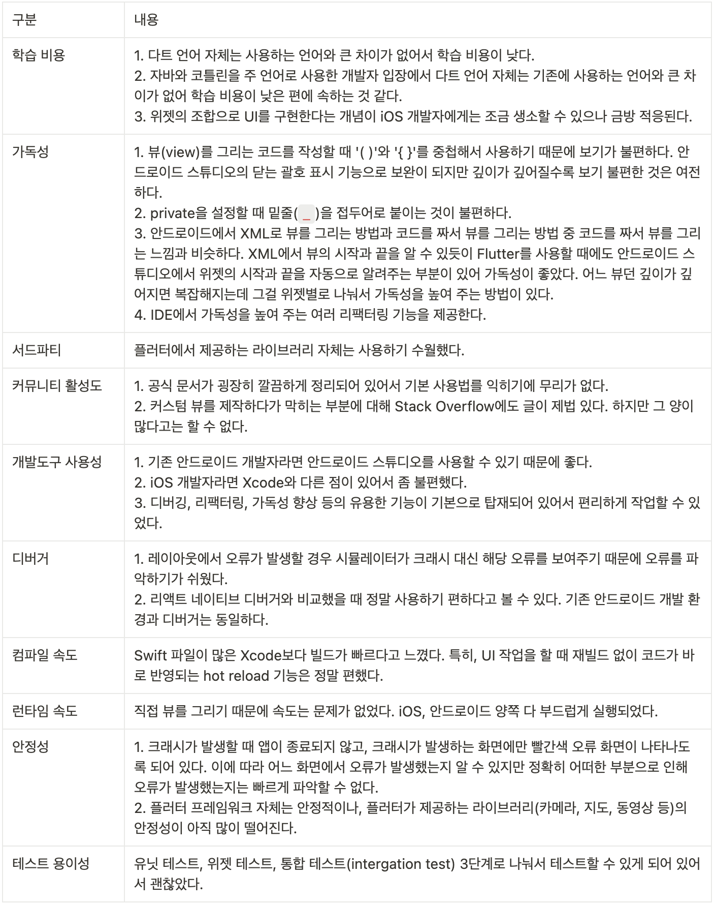

## 플러터란?

플러터는 구글이 출시한 오픈소스 크로스플랫폼 GUI 애플리케이션 프레임워크입니다. 안드로이드, iOS, 윈도우즈, 리눅스 및 웹 애플리케이션과 구글 퓨시아 앱의 주된 소스코드로 사용됩니다. 2.0 버전부터 웹 애플리케이션을 지원했으며, 3.0 버전에서는 맥OS와 윈도우즈 애플리케이션도 지원하게 되었습니다.

### 플러터 기반의 대표적인 서비스

우리가 알만한 몇 가지 서비스를 소개하겠습니다. 플러터 공식 홈페이지에서 제공되는 각 서비스의 성공 지표는 다음과 같습니다. 네이버 지식iN에 대한 설명은 다음 장에서 계속됩니다.

- 네이버 지식iN
- 구글 페이
  - 엔지니어의 노력 70% 감소, 코드 라인 수 35% 감소
- 텐센트
  - 개발 시간이 33% 감소, 앱 코드에서 플러터의 비중은 90%
- eBay 모터스
  - 네이티브보다 개발 속도가 2배 빠르다고 생각하는 개발자 비중이 70%
- BMW

## 플러터 구조 및 동작 원리

플러터는 세 가지 계층으로 구성됩니다. 하드웨어와 직접 통신하는 임베더 계층, C++로 작성된 엔진 계층, 그리고 개발자들이 주로 사용하는 프레임워크 계층입니다. 임베더 계층은 6개 플랫폼의 네이티브 플랫폼과 통신하며 운영체제 기능을 모듈화합니다. 엔진 계층은 플러터 코어 API, 스키아 그래픽 엔진, 파일 시스템, 네트워크 기능 등을 정의합니다.

프레임워크 계층에는 플러터를 사용하는 데 필수적인 위젯, 애니메이션, 매터리얼 디자인 패키지, 쿠퍼티노 디자인 패키지 등이 포함됩니다. 이렇게 세 가지 계층으로 나뉘고 잘 모듈화된 아키텍처 덕분에 플러터는 다양한 플랫폼을 쉽게 지원하며, 일관된 API 및 개발 경험을 제공합니다.


플러터는 스키아 엔진을 지원하는 모든 플랫폼에서 실행될 수 있도록 구현됩니다. 플러터 팀은 iOS와 안드로이드 앱뿐만 아니라 윈도우, 리눅스, 맥OS 애플리케이션, 심지어 웹사이트까지 플러터 코드로 배포할 수 있도록 했습니다. 플러터를 사용하면 한 번에 6가지 플랫폼에 애플리케이션을 배포할 수 있습니다.

플러터가 스키아 엔진을 사용할 때의 장점은 무엇일까요? 대부분의 크로스플랫폼 앱 개발 프레임워크들은 웹뷰를 사용하거나 각 플랫폼의 UI 라이브러리를 사용합니다. 하지만 플러터는 웹뷰를 사용하지 않고 직접 스키아 엔진을 이용하여 화면에 UI를 그립니다.

> 기존의 플랫폼에서 제공되는 UI를 모두 버리고 자체적으로 UI를 렌더링하기 때문에 iOS에서 매터리얼 디자인과 ripple 애니메이션을 볼 수 있고, 안드로이드에서 쿠퍼티노 디자인을 사용할 수 있습니다.
>
> 플러터는 화면 전체를 2D 그래픽 API로 fillRect하고, drawText와 drawImage를 사용하여 앱을 만드는 것과 같은 방식으로 스키아 기반으로 렌더링해줍니다. 이는 웹 개발에서 HTML을 모두 무시하고 전체를 플래시나 캔버스로 만드는 것과 유사합니다.


예를 들어, 플러터의 대표적인 경쟁 프레임워크인 리액트 네이티브는 자바스크립트 브릿지를 통해 플랫폼과 통신합니다. 또한 플랫폼의 UI(OEM 위젯)를 그대로 사용합니다. 그래서 플랫폼과 리액트 네이티브 간의 통신에는 상당한 리소스 비용이 듭니다. 하지만 플러터는 위젯을 스키아 엔진에 직접 그려내고 필요한 제스처 및 이벤트를 브릿지를 통하지 않고 실행하기 때문에 리액트 네이티브에 비해 상당히 빠른 성능을 자랑합니다.

참고로 플러터 팀은 초당 60프레임을 목표로 많은 노력을 기울인다고 합니다.


## 다트 언어를 채택한 이유

다트는 2011년에 구글이 개발한 클라이언트-사이드 개발 언어입니다. 처음에는 자바스크립트를 대체하기 위한 언어로 소개되었으며, 실제로 처음 제공한 트랜스 컴파일 결과물도 자바스크립트였습니다. 다트는 JIT(Just-In-Time) 컴파일을 통해 VM 위에서 동작하는 방식과 AOT(Ahead-Of-Time) 컴파일을 통해 런타임에서 바로 동작하는 방식을 모두 지원합니다.

JIT 컴파일은 인터프리터처럼 실행 전에 코드를 컴파일하지 않아도 되기 때문에, 코드 수정 시 발생하는 빌드 시간을 줄여 개발자들이 더 편리하게 개발할 수 있는 장점이 있습니다. 그러나 VM 위에서 동작하기 때문에 대부분의 코드가 네이티브 플랫폼에 비해 성능상 느리다는 단점이 있습니다. 그러나 다트는 AOT 컴파일도 지원하기 때문에 실제 배포 시 AOT 컴파일을 통해 런타임에서 바로 동작하는 코드를 생성할 수 있습니다.

> AOT 컴파일은 다트 2버전이 나오면서 추가된 기능인데, 아마도 플러터 팀의 요청이 있었을 것이라고 생각합니다.


혹시 다른 언어도 다트처럼 JIT와 AOT 컴파일러를 둘다 사용하는지 궁금해서 검색을 해봤는데, 다트처럼 개발 단계와 릴리즈 단계에서 각각 다른 컴파일 방식을 사용하는 언어는 없었습니다.

1. **C# / .NET**: .NET Core와 .NET 프레임워크는 JIT 컴파일을 기본으로 하지만, .NET Native나 AOT 컴파일 옵션을 통해 AOT 컴파일도 가능합니다.
2. **Dart**: Dart 언어는 플러터에서 주로 사용되며, AOT와 JIT 둘 다 지원합니다. 개발 중에는 JIT 컴파일을 사용하여 빠른 개발 사이클을 유지하고, 릴리즈 시에는 AOT 컴파일을 사용하여 최적의 성능을 달성합니다.
3. **JavaScript / TypeScript**: 일반적으로 자바스크립트는 인터프리터 언어로 분류되며, JIT 컴파일이 많이 사용됩니다. 그러나 웹 어셈플리를 통해 AOT 컴파일도 가능합니다.
4. **Rust**: 러스트는 기본적으로 AOT 컴파일을 사용하지만, JIT 컴파일을 가능하게 하는 라이브러리도 존재합니다.
5. **Go**: Go 언어는 주로 AOT 컴파일을 사용하지만, 몇몇 특별한 상황에서는 JIT 컴파일을 사용하는 경우도 있습니다.

### hot reload

플러터의 hot reload를 사용하면 개발 시간을 단축시키고 거의 즉시에 가까운 속도로 개발할 수 있습니다. 이 기능은 다트의 JIT 컴파일을 기반으로 하며, 다트가 JIT 컴파일을 지원하기 때문에 앱을 즉시 수정하고 실행할 수 있습니다.

> 제니퍼 화면 개발 중 웹팩 번들러에서 제공하는 hot reload를 사용합니다. 수정된 코드가 빌드되고 브라우저에 반영되는 과정에는 몇 초의 시간이 소요되어 답답한 경우가 종종 있습니다. 이는 제니퍼의 소스 코드 규모가 방대하고 웹팩을 그대로 사용하기 때문에 발생하는 현상일 수 있습니다. 물론 최근 Vercel에서 발표한 터보팩과 같은 번들러는 더 빠를 수도 있습니다.

## 네이버의 플러터 도입 과정

최근에 데이빗과 플러터 스터디를 진행하면서 모니터링 스터디 주제로 선정해야겠다는 생각을 했었습니다. 관련해서 검색해보는데, [네이버의 플러터 도입 과정](https://d2.naver.com/helloworld/3384599)을 블로그에 자세히 올린게 있어서 개인적으로 느낀 점이 많아 이렇게 소개해보려고 합니다.

먼저, 크로스플랫폼 도입을 검토하게 된 이유가 흥미로웠습니다. 네이버 정도되는 규모의 회사에서는 서비스 앱 개발을 어떤 프로세스로 진행하는지 어느 정도 파악할 수 있었습니다. 특히 디자인 단계에서의 어려움은 iOS와 안드로이드에서 모두 동일한 UI를 제공하려고 하더라도 구현하기 어려운 UI가 존재한다는 것이었습니다.

각 플랫폼마다 개발, 테스트, 배포를 진행하며, 플랫폼 상황에 따라 배포 일정이 달라질 수 있고, 서비스 상황에 따라 개발자 불균형 문제가 발생할 수 있다는 점입니다. 또한, 기획을 제외하고 디자인부터 별도의 프로세스로 진행되는 것이 인상 깊었습니다.


이와 같은 상황에서 최대한 개발 효율성을 높이고자 다양한 방법을 시도했는데, 과거 네이버 블로그 앱 개발팀에 있던 시절에는 아래와 같은 방법을 시도했다고 말합니다.

- 기술 공유
- 네이밍 컨벤션 맞추기
- 라이브러리 개발

기술 공유의 경우에는 서로 다른 플랫폼 간에 도움을 주는 지식이 아니기 때문에 시간이 흐를수록 꾸준한 참여를 유지하기 어려웠으며, 플랫폼 별로 선호하는 네이밍 컨벤션이 다르고 개발 일정에 따라 매번 컨벤션을 맞추기 어렵다는 한계가 있었습니다.

또한, 팀 내에서 라이브러리 개발을 담당하는 인원이 필요하다는 문제가 있었고, 꾸준한 관리가 어려워서 서비스 별로 다른 스펙을 라이브러리로 구현하기도 어렵다는 문제도 있습니다.

다음은 플랫폼의 차이와 관련하여 비슷한 경험이 있는지 사내 모바일 개발자를 대상으로 설문 조사를 진행하여 다음과 같은 결과를 얻었습니다.


대다수 개발자들은 플랫폼에 특화된 스펙을 구현하는 것이 어려웠고, 개발자 불균형으로 인해 프로젝트 진행에 문제가 있었다는 것을 알 수 있습니다. 또한, 서비스 상황에 따라 크로스플랫폼이 필요하다고 생각하는 비율도 월등히 높았다고 언급합니다.

결국 네이버는 프로토타입 프로젝트도 진행해 보고, 개발자 불균형 문제를 겪으면서 더 효율적인 개발 방법은 없을까 고민한 결과, 팀에서 크로스플랫폼을 검토하기로 결정했습니다. 대부분의 팀원들은 크로스플랫폼에 대해 회의적인 시각을 가졌으며, 네이티브 방식으로 개발한 앱보다 실행 성능이 낮을 것으로 예상하여 검토를 시작했다고 합니다. 하지만 검토를 진행하면서 이 부분이 편견이었음을 알았으며, 지식iN 앱을 플러터 기반으로 개발하고 정식 서비스를 시작했습니다.

### 크로스플랫폼에 도전

1차 테스트로 일주일 동안 6명의 개발자가 플러터, 리액트 네이티브, 자마린(xamarin), SCADE 4개의 크로스플랫폼에 대한 성능과 생산성을 검토했습니다. 크로스플랫폼 도입을 위한 과정이 체계적이고, 많은 노력을 기울였기 때문에 크로스플랫폼 도입을 검토하는 사람들에게 많은 도움이 될 것으로 생각합니다.


평가 기준을 바탕으로 각 플랫폼을 비교한 결과, 플러터가 가장 좋은 평가를 받았습니다. 특히, 플러터의 성능은 팀에서 기대한 것보다 훨씬 우수하게 나왔습니다. 화면 동작에서는 네이티브 방식과 구분하기 어려울 정도의 성능을 보였다고 합니다.

네이버에서는 추가적인 검증을 위해 2차 테스트를 진행했는데, 플러터로 어떤 단계까지 구현이 가능한지 확인하기 위해 조금 더 난이도가 있는 앱을 과제로 삼았습니다. 약 2개월 동안 진행된 프로토타입 서비스를 플러터로 구현하기로 하고, iOS 개발자 4명과 안드로이드 개발자 3명이 약 2주 동안 테스트를 진행했습니다.

추가 기능을 테스트하기 위해 라이브러리, Google 지도, 웹뷰, 커스텀 UI 등을 구현하여 확인한 결과, iOS 개발자 6명과 안드로이드 개발자 6명이 2개월 동안 개발한 서비스를 2주 만에 유사하게 구현했습니다.


팀원들의 공통적인 의견은 각각 네이티브 방식으로 개발할 때보다 훨씬 수월했다는 점입니다. 사용성 확인을 위해 UI에 굉장히 집중한 프로토타입 서비스에서는 플러터가 네이티브 방식보다 훨씬 빠르고 편하게 UI를 구현할 수 있기 때문입니다. 특히 안드로이드 개발자들의 만족도가 높았다고 합니다.

다음은 2차 테스트를 마무리하고, 팀원들이 작성한 플러터에 대한 피드백을 요약한 내용입니다. 내용을 가볍게 살펴보시면 좋을 것 같습니다.



## 플러터 스터디를 하면서 느낀점

다트 문법이 자바나 코틀린이랑 비슷하기 때문에 플러터 개발은 고대(?) 유물인 자바 스윙이 떠오르긴 했었는데, 전혀 아니었습니다. 네이버 팀에서 플러터로 개발할 때 개발 기간이 짧아진 이유에 대해 다트 언어의 어렵지 않은 문법과 플러터의 선언형 UI 방식 때문이라고 결론을 내렸는데, 제 생각도 동일합니다.

선언형 UI 방식은 복잡한 UI를 작성할 때 이해하기에 더 직관적이기 때문에 유리합니다. 사실, 프론트엔드 개발자라면 익숙한 HTML이나 JSX, 뷰 템플릿 문법들은 모두 선언형으로 볼 수 있습니다.

아래 코드를 비교하면 명령형과 선언형의 차이를 쉽게 이해할 수 있습니다.

```javascript
// Imperative style
b.setColor(red)
b.clearChildren()
ViewC c3 = new ViewC(...)
b.add(c3)
```
Win32에서 웹, Android 및 iOS에 이르는 프레임워크는 일반적으로 명령형 UI 프로그래밍 스타일을 사용합니다. 이 스타일은 여러분이 가장 익숙한 스타일일 수 있는데, UIView 또는 이와 동등한 기능을 갖춘 UI 엔티티를 수동으로 구성하고 나중에 UI가 변경되면 메서드와 설정자를 사용하여 변경하는 방식입니다.

```javascript
// Declarative style
return ViewB(
  color: red,
  child: const ViewC(),
);
```

반면, 플러터는 개발자가 다양한 UI 상태 간 전환 방법을 프로그래밍해야 하는 부담을 덜어주기 위해 개발자가 현재 UI 상태를 설명하고 전환은 프레임워크에 맡길 수 있도록 합니다.

### 개발자 도구

플러터 2.0부터 개발자 도구가 지원되었는데, 직접 사용해보니 매우 편리했습니다. 앞에서 언급한 hot reload와 함께 개발자 도구는 개발 생산성을 크게 향상시킬 것으로 기대됩니다.


### 예제 소개

먼저, 웹툰 예제는 노마드코더의 클론 코딩 강의에서 다룬 내용을 따라서 구현한 것입니다. 플러터는 네이티브 앱 수준의 페이지 전환 효과를 쉽게 구현할 수 있도록 관련 API를 제공합니다. 강의 댓글 중에서 흥미로운 내용을 발견했는데, 리액트 네이티브로 동일한 기능을 구현하는 것은 매우 어렵다며, 플러터로는 정말 간단하게 구현할 수 있다는 점이 좋았다는 것이었습니다.

플러터는 iOS의 쿠퍼티노 디자인 패키지를 지원하지만 네이티브 앱만큼 완벽하지는 않습니다. 시간이 지남에 따라 네이티브 앱과의 디자인 격차는 더 벌어질 것으로 예상됩니다. 필요에 따라 플러터의 디자인 패키지에서 제공하지 않는 UI를 개발해야 할 수도 있습니다. 이런 경우, 개발자는 CustomPainter 클래스를 상속받아 직접 캔버스에 그릴 수 있습니다.

이렇게 구현한 클래스는 결국 플러터에서 제공되는 위젯들과 동일한 위젯으로 취급되기 때문에 기존의 위젯들과 함께 자연스럽게 사용할 수 있습니다. 제니퍼에서 캔버스를 활용하여 만든 컴포넌트들 중에는 기존의 마크업이나 스타일과 함께 사용되는 경우도 있지만, 서로 독립적인 부분도 있으며, 특히 이벤트를 구현할 때 고려해야 할 사항이 많습니다.

마지막으로 플러터와 관련된 검색 중에 토스 앱에 있는 3D 인터랙션을 플러터로 구현한 예제를 발견했습니다. 개인적으로 토스의 UX/UI가 매우 훌륭하다고 생각하는데, 일부 기능 중 하나를 플러터로 쉽게 구현한 것을 보고 플러터의 가능성을 높게 평가하게 되었습니다.


1. [페이지 전환 예제](https://flutter-for-beginners.vercel.app) : 페이지 전환시 효과를 쉽게 구현할 수 있습니다. (데스크탑 브라우저에서는 이미지가 보이지 않음)
2. [캔버스 그리기 예제](https://flutter-playground.vercel.app) : 캔버스에 그라디언트 효과를 주고, 심볼(별모양)을 직접 그려서 무작위로 화면에 보여지는 배경 위젯입니다.
3. [3D 인터랙션 예제](https://toss-gift-card.vercel.app) : 토스 앱의 상품권 추가시 3D 인터랙션을 구현한 예제입니다.

## 글을 마치며

플러터 스터디를 진행하고 모니터링 스터디 발표 자료를 준비하면서 몇 가지 결론을 내리게 되었습니다. 첫째로, 데스크탑과 모바일은 완전히 다른 기획과 사용자 경험이 필요하다는 것입니다. 모바일은 프론트엔드 영역이 아니라 플랫폼에 종속된 전혀 다른 분야로 생각하고 크게 고민하지 않았습니다. 사실 플랫폼이 iOS와 안드로이드로 크게 나뉘어져 있기 때문에 어느 한 쪽을 선택하는 것이 어려웠습니다. 플러터 덕분에 이러한 선택의 어려움을 해결하고, 본격적으로 모바일 UX에 대해 알아볼 수 있게 되었습니다.

두 번째로, 이건 지극히 개인적인 사정이긴 한데, 프레임워크의 발전과 ChatGPT의 등장으로 프론트엔드 개발자로서 성장의 한계를 느끼고 있던 시점에 플러터를 발견하여 데스크탑 웹을 넘어 여러 플랫폼으로 프론트엔드 역량을 확장해나가야겠다는 새로운 목표가 생겼습니다.

데스크탑과 모바일을 모두 고려한 서비스가 무조건 성공하는 것은 아니지만, 현재 성공한 서비스들을 살펴보면 둘 중 하나만 지원되는 서비스는 드물다고 생각됩니다. 네이버의 플러터 도입 검토 과정을 보면 알 수 있듯이, 보다 적은 인원으로 네이티브 수준의 애플리케이션을 개발할 수 있다는 것은 개발 인원이 적은 조직에서 충분히 고려해볼 만하다고 생각합니다.

## 참고 링크

- [[Flutter] 어떻게 플러터는 다른 크로스 플랫폼보다 더 강력한 성능을 내는 걸까?](https://goldenrabbit.co.kr/2023/04/02/flutter-1/)
- [[Flutter] 상품권 추가 3D 인터랙션](https://velog.io/@cyb9701/%ED%86%A0%EC%8A%A4-%EC%83%81%ED%92%88%EA%B6%8C-3D-%EC%9D%B8%ED%84%B0%EB%9E%99%EC%85%98)
- [Flutter(플러터)가 Dart(다트) 언어를 사용하는 이유](https://beomseok95.tistory.com/315)
- [지식iN 앱을 Flutter로 개발하는 이유](https://d2.naver.com/helloworld/3384599)