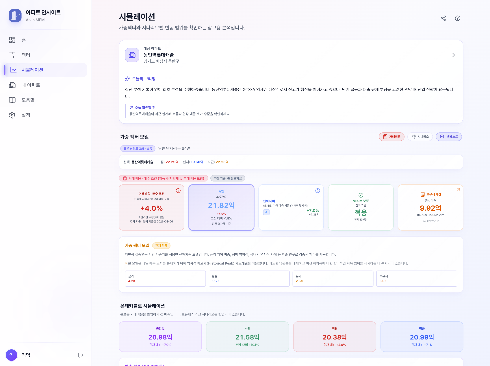
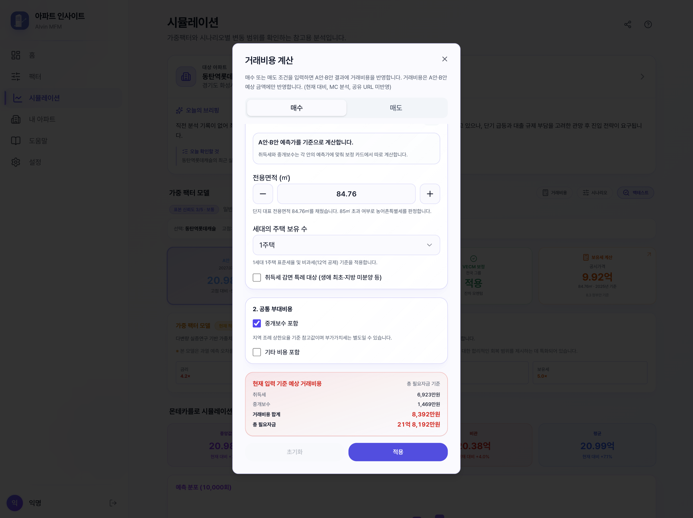

아파트 매매를 검토할 때 가장 먼저 보는 숫자는 매매가격입니다. 하지만 실제로 준비해야 하는 돈은 매매가격과 다를 수 있습니다. 매수할 때는 취득세와 중개보수 같은 비용이 더해지고, 매도할 때는 양도소득세와 중개보수 등이 빠지기 때문입니다.

그래서 같은 아파트의 같은 가격을 보더라도 질문은 두 가지로 나누어야 합니다.

- **매수한다면 현금이 얼마나 더 필요한가**
- **매도한다면 최종적으로 얼마를 받을 수 있는가**

이 글에서는 이 두 질문을 분리해서 거래비용을 계산하는 방법과, 아파트 인사이트의 거래비용 계산기가 어떤 방식으로 결과를 보여주는지 정리합니다. 세율과 감면 요건은 거래일·자산 상태·가구 조건에 따라 달라질 수 있으므로, 특정 금액을 확정하기보다 계산 결과를 자금 계획을 위한 참고값으로 읽는 데 초점을 둡니다.

<!-- truncate -->

## 거래비용은 가격 예측과 다른 숫자다

가격 예측은 앞으로의 가격 경로를 추정하는 일이고, 거래비용 계산은 그 가격으로 실제 거래할 때 발생할 현금흐름을 가늠하는 일입니다. 둘을 한 숫자로 섞으면 “가격이 올랐다”와 “필요한 현금이 늘었다”를 혼동하기 쉽습니다.

거래 방향에 따라 결과의 의미도 달라집니다.

| 거래 방향 | 계산에 더하거나 빼는 항목                          | 결과를 읽는 기준  |
| --------- | -------------------------------------------------- | ----------------- |
| 매수      | 취득 관련 세금, 중개보수, 선택한 기타 비용         | **총 필요자금**   |
| 매도      | 양도소득세, 지방소득세, 중개보수, 선택한 기타 비용 | **예상 순수령액** |

시뮬레이션에서는 거래비용을 A안·B안의 최종 금액에 반영합니다. 매수의 `+` 보정은 예측가격이 상승했다는 뜻이 아니라, 거래를 위해 준비할 현금이 늘었다는 뜻입니다. 반대로 매도 결과의 음수 보정은 세금과 비용을 차감한 뒤 예상 순수령액이 줄어드는 구조를 나타냅니다.

다만 모든 화면이 같은 기준을 쓰는 것은 아닙니다. 현재 가격과 비교하는 카드는 가격 자체의 변화를 보여주는 자리이므로 거래비용을 제외한 가격 기준을 유지하고, 확률 분포 역시 거래비용 반영 전 예측으로 표시합니다. 이 범위를 분리해야 가격 전망과 현금 계획을 서로 다른 질문으로 읽을 수 있습니다.

## 기능은 어디에서 시작할까

시뮬레이션의 가중 팩터 모델 영역에서 `거래비용` 버튼을 누르면 매수 또는 매도 한 방향을 선택해 조건을 입력할 수 있습니다. 적용 후에는 A안·B안 각각에 맞춘 거래비용 보정 카드가 추가됩니다.



화면의 보정 카드에서 확인할 수 있는 핵심은 세 가지입니다.

1. 거래 방향이 매수인지 매도인지
2. 비용이 가격 예측이 아니라 총 필요자금 또는 예상 순수령액 기준인지
3. 어떤 정책 기준일과 입력 조건으로 계산했는지

거래비용 계산은 현재 시뮬레이션 화면의 조건을 바탕으로 동작합니다. 계산 결과가 과거 예측 이력이나 공유 결과에 그대로 저장되는 방식이 아니므로, 다른 조건을 비교할 때는 해당 조건을 다시 입력해 확인해야 합니다.

## 매수: 예측가에 비용을 더해 총 필요자금 보기

매수 쪽 계산은 다음과 같은 구조로 이해하면 쉽습니다.

```text
총 필요자금
= 매수 기준금액
+ 취득세 관련 비용
+ 중개보수
+ 선택한 기타 비용
```

### 취득 관련 비용

주택 매수에서는 취득세를 중심으로 지방교육세와 농어촌특별세가 함께 검토될 수 있습니다. 실제 적용 여부와 금액은 취득가액, 주택 보유 수, 조정대상지역 여부, 주택의 전용면적, 거래 형태 등에 따라 달라집니다.

계산기에서는 일반 아파트 매매와 분양권 거래 조건을 구분하고, 주택 보유 수가 여러 채인 경우에는 중과 적용 여부를 별도로 확인합니다. 필요한 조건을 선택하지 않은 상태에서 임의의 세율을 적용하지 않고 `계산 보류`로 두는 이유도 여기에 있습니다.

전용면적은 농어촌특별세 적용 여부를 판단하는 입력으로 사용됩니다. 단지 대표 면적을 참고값으로 채우더라도 사용자가 실제 계약 면적으로 수정할 수 있어야 하며, 면적이 표시되었다고 해서 다른 세금 요건까지 자동으로 확정되는 것은 아닙니다.

### 중개보수와 기타 비용

중개보수는 법정 상한요율을 기준으로 한 참고값입니다. 실제 보수는 지역 조례와 거래금액 구간, 중개의뢰인과 중개사 사이의 협의에 따라 달라질 수 있고 부가가치세가 별도로 붙을 수 있습니다. 따라서 계산기에서 중개보수를 포함하더라도 계약 전에는 중개사에게 실제 협의 금액을 확인해야 합니다.

기타 비용은 법정 비용으로 단정하지 않고 사용자가 직접 입력하는 참고 항목으로 보는 편이 안전합니다. 법무사 비용, 인지대, 이사비, 대출 관련 비용처럼 거래 구조에 따라 달라지는 항목은 계약 조건과 금융기관 안내를 따로 확인해야 합니다.

## 매도: 세금과 비용을 빼고 예상 순수령액 보기

매도 쪽은 매수와 반대 방향으로 계산합니다.

```text
예상 순수령액
= 매도 기준금액
- 양도소득세
- 지방소득세
- 중개보수
- 선택한 기타 비용
```

양도소득세는 단순히 “현재 가격과 미래 가격의 차이”만으로 결정되지 않습니다. 취득가액과 필요경비, 취득일과 양도일, 보유기간, 거주기간, 자산 상태, 주택 보유 수, 비과세·중과 요건 등을 함께 봐야 합니다.

특히 A안과 B안의 목표 시점이 서로 다르면 보유개월과 거주기간도 달라집니다. 한 시나리오에서는 장기 보유 요건을 충족하고 다른 시나리오에서는 단기 세율이 적용되는 것처럼, 두 안의 세율 체계가 달라질 수 있습니다. 이럴 때 두 결과에 같은 비율을 적용하면 계산은 간단해 보여도 조건을 제대로 반영하지 못합니다.

양도차손처럼 과세할 양도소득이 없는 경우에는 납부 세액이 0원으로 표시될 수 있습니다. 0원이 표시되었다고 해서 모든 신고 의무나 계약 관련 비용이 사라지는 것은 아니므로, 실제 신고와 비용 확인은 별도로 진행해야 합니다.

## 입력 다이얼로그에서는 무엇을 확인할까



입력 화면은 항목을 많이 채우는 것보다 **계산 기준이 무엇인지 확인하는 것**이 중요합니다.

### 1. 매수와 매도 방향을 먼저 고르기

매수와 매도 비용은 서로 다른 세금과 결과 표현을 사용합니다. 한 방향을 적용한 뒤 반대 방향으로 바꾸면 이전 거래비용 상태를 이어 붙이지 않고 새 조건으로 다시 계산하는 흐름이 안전합니다.

### 2. 기준일과 금액을 실제 계약 조건에 맞추기

취득가액, 취득일, 양도 예정일, 매수 예정일, 주택 보유 수 같은 입력은 세율 체계와 기간 요건에 영향을 줍니다. 빈 값을 0원이나 임의의 날짜로 채워 계산하는 것보다, 필요한 값이 없으면 계산을 멈추고 추가 입력을 요청하는 편이 낫습니다.

### 3. 포함할 부대비용을 선택하기

중개보수와 기타 비용은 체크한 항목만 합계에 들어갑니다. 포함 여부를 바꾸면 A안·B안의 보정값도 함께 달라지므로, 결과를 저장하거나 공유하기 전에 체크 상태를 다시 확인해야 합니다.

### 4. 계산 보류 메시지를 무시하지 않기

다주택 중과 여부를 선택하지 않았거나, 필요한 취득가·취득일이 없거나, 지원하지 않는 감면 특례를 주장하는 경우에는 정확한 금액 대신 `계산 보류`가 표시될 수 있습니다. 이것은 오류라기보다 근거가 부족한 숫자를 확정값처럼 보여주지 않기 위한 안전장치입니다.

## 분양권은 일반 아파트 매매와 따로 봐야 한다

분양권 거래에서는 분양가와 현재 거래금액이 같은 의미가 아닙니다. 기준 분양가에 기납부금, 옵션비, 프리미엄 또는 마이너스 프리미엄을 반영해 실제 거래금액을 구성해야 합니다.

### 마피와 플러스피

마이너스 피는 기준 분양가에서 프리미엄을 차감하는 구조이고, 플러스 피는 프리미엄을 더하는 구조입니다. 다만 마피 차감액만으로 매수 총액이 완성되는 것은 아닙니다. 중도금 미납분, 이자후불제 승계, 옵션·확장비 등은 별도로 확인해야 합니다.

### 손피는 별도 계산이 필요하다

손피는 매도자가 세후 프리미엄을 확보하고 매수자가 양도소득세와 지방소득세를 대신 부담하는 특수한 계약 조건입니다. 일반 거래비용 계산에 손피 세액을 섞으면 프리미엄·양도세·취득세의 기준금액이 혼동될 수 있습니다.

1년 미만 70%, 1년 이상 60%의 단기보유 세율과 대납세액 재산입을 포함한 계산은 별도 글에서 자세히 설명하고 있습니다. [분양권 손피 계산기: 프리미엄 3,000만원이면 실제 부담액은?](/blog/sonpi-tax-calculator/)

## 왜 모든 조건을 계산해 주지 않을까

거래비용 계산기에서 일부 입력은 금액이 나오지 않고 보류됩니다. 대표적인 이유는 다음과 같습니다.

- 생애 최초·지방 미분양·인구감소지역 등 취득세 감면 특례의 적용 여부가 개인 조건과 법령 해석에 따라 달라지는 경우
- 다주택 중과와 중과 유예 중 어느 기준을 적용할지 선택하지 않은 경우
- 취득일이 양도일보다 늦거나, 기준 분양가처럼 핵심 금액이 없는 경우
- 분양권의 전매제한 해제일과 매수 예정일 관계를 공식 근거로 확인하지 못한 경우

세금 계산에서 가장 위험한 것은 빈칸을 그럴듯한 기본값으로 채워 정확해 보이는 금액을 보여주는 것입니다. 계산 보류는 사용자가 계약 조건과 공식 근거를 먼저 확인하도록 만드는 경계선입니다.

## 거래비용을 적용한 결과를 읽는 순서

실제 화면에서는 다음 순서로 읽으면 혼동이 적습니다.

1. **기준 예측**: 거래비용을 적용하기 전 A안·B안 가격 확인
2. **가격 조건 보정**: 시나리오·보유세 등 가격 자체에 영향을 주는 조건 확인
3. **거래비용 계산**: 매수 총 필요자금 또는 매도 예상 순수령액 계산
4. **최종 카드 확인**: A안·B안별 세금·중개보수·기타 비용과 최종 금액 확인
5. **범위 안내 확인**: 현재 대비 카드와 확률 분포는 거래비용을 반영하기 전 가격 기준인지 확인

이 순서를 지키면 “예상가격이 올랐는데 왜 현금 부담도 늘었나”와 같은 질문을 분리해서 볼 수 있습니다. 가격 비교는 가격대로, 자금 계획은 거래비용을 포함한 현금흐름대로 확인하는 것입니다.

## 계산 전에 준비할 체크리스트

- 거래 방향: 매수인지 매도인지
- 기준 금액: 취득가액·양도가액·분양가·프리미엄·기납부금
- 날짜: 취득일·양도 예정일·매수 예정일·전매제한 해제일
- 보유 조건: 세대의 주택 수, 보유기간, 거주기간
- 자산 상태: 등기 후 주택인지 분양권인지
- 중개보수: 지역 상한요율과 실제 협의 금액
- 감면·중과 조건: 공식 근거와 전문가 확인 여부
- 계산 기준일: 세법과 조례가 언제 기준인지

## 참고할 공식 자료

- [국세청 양도소득세 개요](https://www.nts.go.kr/nts/cm/cntnts/cntntsView.do?cntntsId=7666&mi=2308): 양도소득세의 과세 구조와 기본 개념을 확인할 수 있습니다.
- [국세청 양도소득세 세율 안내](https://i.nts.go.kr/nts/cm/cntnts/cntntsView.do?cntntsId=7711&mi=2312): 과세표준별 기본세율과 세율 변동 자료를 확인할 수 있습니다.
- [국가법령정보센터 지방세법](https://www.law.go.kr/법령/지방세법): 취득세를 포함한 지방세 관련 현행 법령을 확인할 수 있습니다.
- [서울특별시 부동산 중개보수 요율표](https://land.seoul.go.kr/land/broker/brokerageCommission.do): 주택·분양권 중개보수의 상한요율과 적용 기준을 확인할 수 있습니다.

공식 자료의 세율과 요건은 개정될 수 있습니다. 따라서 계산기에서 표시하는 정책 기준일을 확인하고, 실제 계약·신고 단계에서는 관할 지방자치단체, 국세청, 중개사, 세무 전문가의 최신 안내를 다시 확인하는 것이 좋습니다.

거래비용 계산은 가격 전망과 별도로 실제 현금흐름을 확인하기 위한 참고 과정입니다. 취득세·양도소득세·중개보수의 기준금액과 적용 조건을 나누어 확인하면, 같은 가격이라도 매수에 필요한 자금과 매도 후 순수령액이 왜 달라지는지 더 정확하게 비교할 수 있습니다.

> 이 글과 계산 결과는 공개된 정책 기준과 입력 조건에 따른 참고용 정보입니다. 실제 세액·중개보수·신고금액·거래 가능 여부를 보장하지 않으며, 투자 권유나 매수·매도 추천이 아닙니다. 최종 계약과 신고 전에는 최신 공식 자료와 전문가 의견을 확인하세요.
